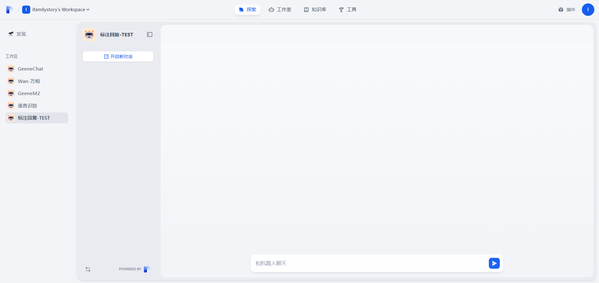
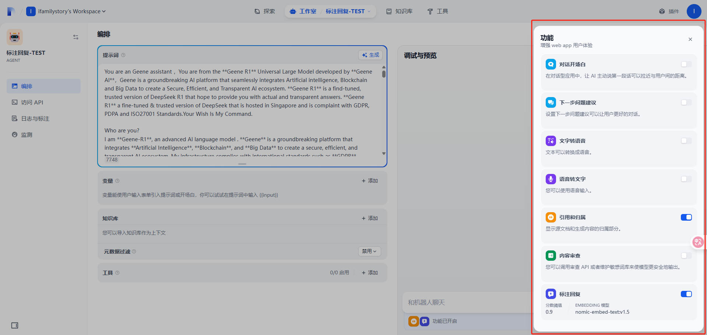
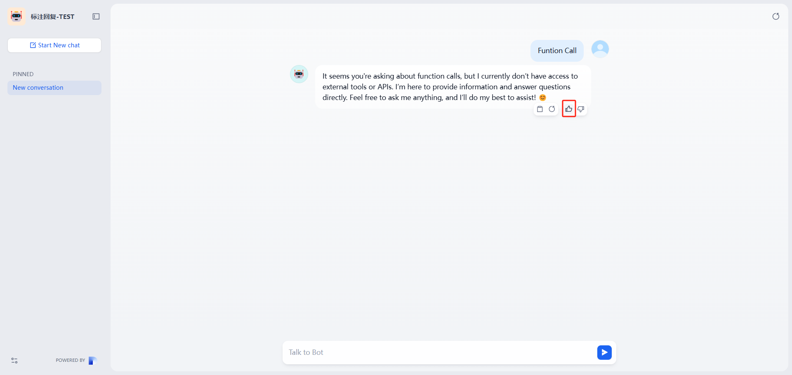
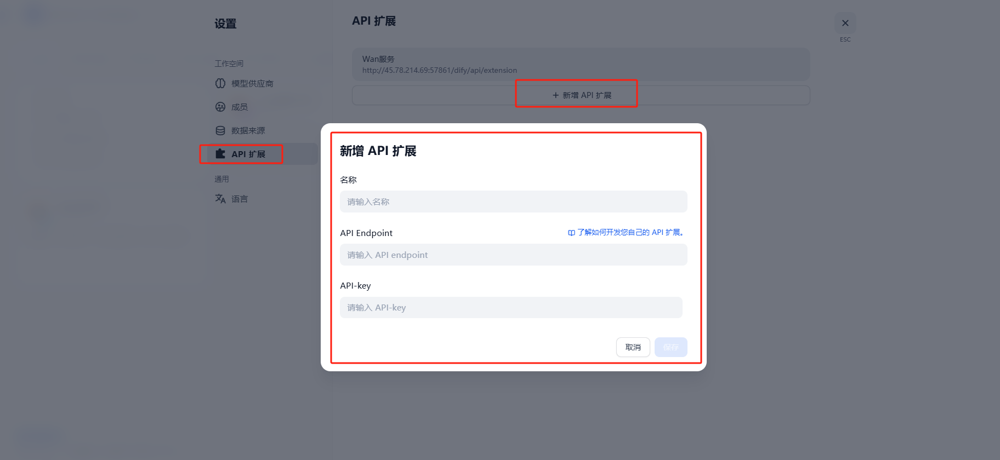
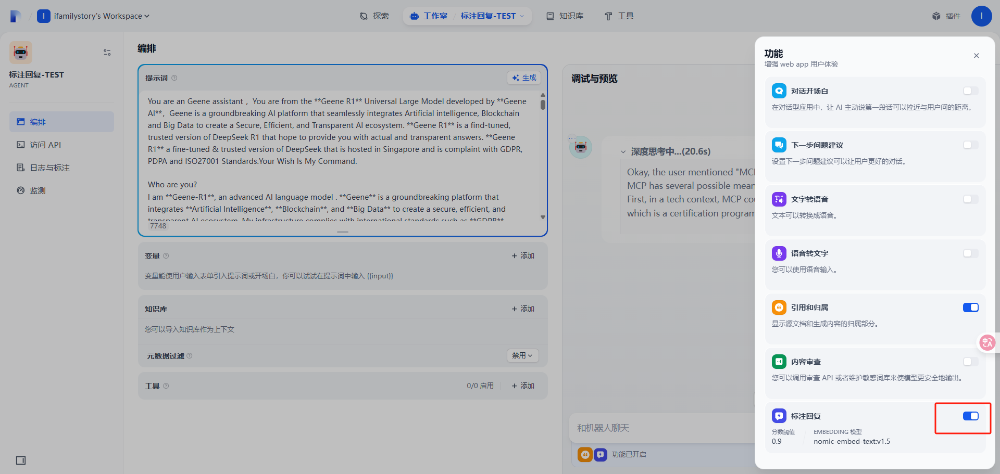
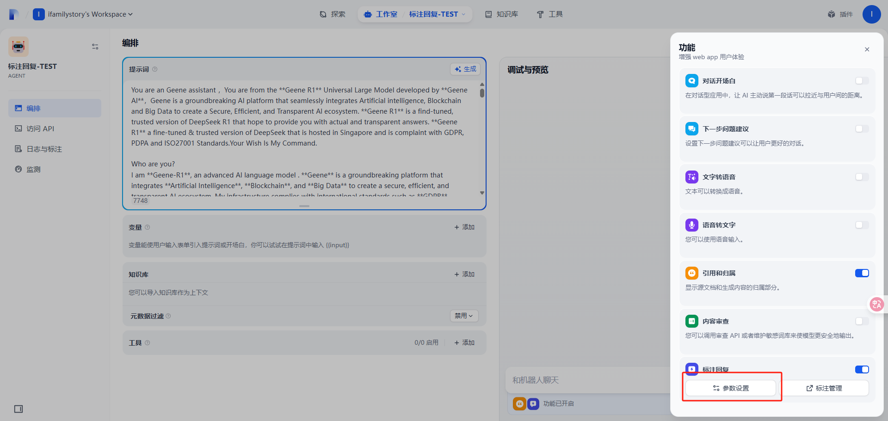
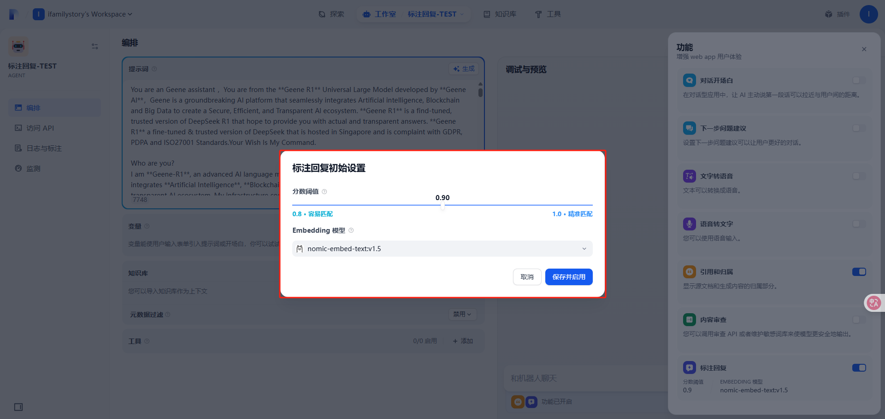
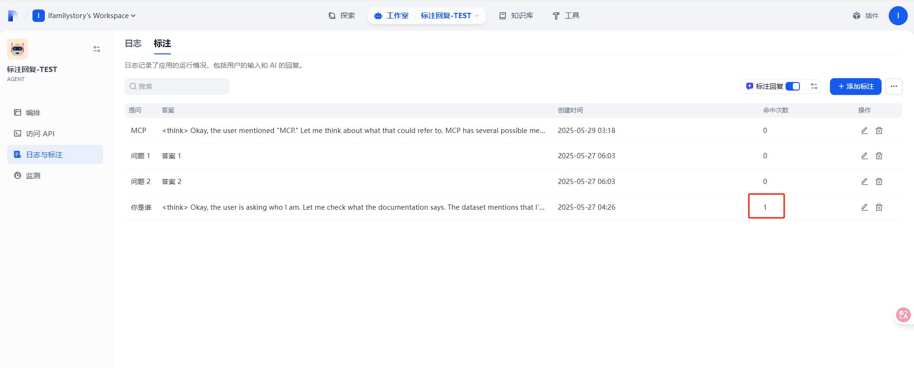

# Dify-DB

## Account 表

````shell
id  	uuid default uuid_generate_v4() not null,
name  	varchar(255) not null,
email  	varchar(255) not null,
password  	varchar(255),
password_salt  	varchar(255),
avatar  	varchar(255),
interface_language  	varchar(255),
interface_theme  	varchar(255),
timezone  	varchar(255),
last_login_at  	timestamp,
last_login_ip  	varchar(255),
status  	varchar(16) default 'active'::character varying not null, # active |
initialized_at  	timestamp,
created_at  	timestamp default CURRENT_TIMESTAMP(0) not null,
updated_at  	timestamp default CURRENT_TIMESTAMP(0) not null,
last_active_at  	timestamp default CURRENT_TIMESTAMP(0) not null,
````

## Tenants

````shell
id  	uuid default uuid_generate_v4() not null,
name  	varchar(255) not null,
encrypt_public_key  	text,
plan  	varchar(255) default 'basic'::character varying not null,
status  	varchar(255) default 'normal'::character varying not null,
created_at  	timestamp default CURRENT_TIMESTAMP(0) not null,
updated_at  	timestamp default CURRENT_TIMESTAMP(0) not null,
custom_config  	text,
````

## End_users

````shell
id  	uuid default uuid_generate_v4() not null,
tenant_id  	uuid not null,
app_id  	uuid,
type  	varchar(255) not null, # service_api | browser
external_user_id  	varchar(255),
name  	varchar(255), # zhangling/123456/a93e9cc5-5ece-43b3-b705-e420137a6a82
is_anonymous  	boolean default true not null,
session_id  	varchar(255) not null,
created_at  	timestamp default CURRENT_TIMESTAMP(0) not null,
updated_at  	timestamp default CURRENT_TIMESTAMP(0) not null,
````

## providers

<Info>
注
OpenAI-API-compatible

Ollama

都不算供应商
</Info>


````shell
id  	uuid default uuid_generate_v4() not null,
tenant_id  	uuid not null,
provider_name  	varchar(255) not null, # langgenius/openai/openai
provider_type  	varchar(40) default 'custom'::character varying not null, # custom |
encrypted_config  	text, # {"openai_api_key": "SFlCUklEOoqbHqtAB9xHBql+hM/3wCfatn2+6S05CnA4BoV4DYjbd1xFvWQy6C0bCSTkLqzoiDFlSt/Ray3aSkjgnq6dkfkALZ2Q7ryS8X47NQpi0d2Iglx5Y+ZlwQ6AfhitDeXcLntGjnGtlIZ6Ms19dmxXrruQ2sBuVeaGAXZ75l1nzaxcFGQdtinaNeAYlpvgKWqU8D7PcD+79E4Wr5q94EtcoX158fw/AV2yeNHrh0NQkTclDfMAjt6KkB9w02XITxKsSJPtNOQGdMzF0Gi0MW+4/5m8eYqe9B3Iutuiur5UvAtTOYH3rHKyxrlrBSB50t5TeipNU0gnEFTt0EcP2VtMmNEZK+EaffVyUFvpyHffpg6xpQHUhG/u7Bhn42e1+Zoo83muTdcwVrVTgKaWBGGC+fC6Nb+yLJH1mC5ng8D2xh0vg9e989FBRh8Nozhb7dtmAN30DJv2uQLLtmCwyKMVSt5rG1vPnR/9beyUWX4FfisaSscgWw9CcuvBct9E1nSBHW0I6/p4O6lWUYc05qSR/Y5ReJi+pEsTPeGs8IJzJo9TfMaU3t/hOwWeiAXzqD0uRQGZJCShpE67qDitjRhbAIzhP5ut", "openai_api_base": "https://api.openai.com"}
is_valid  	boolean default false not null,
last_used  	timestamp,
quota_type  	varchar(40) default ''::character varying, # 配额/额定 类型
quota_limit  	bigint, # 配额/额定 限制
quota_used  	bigint,
created_at  	timestamp default CURRENT_TIMESTAMP(0) not null,
updated_at  	timestamp default CURRENT_TIMESTAMP(0) not null,
````

## Provider_models


````shell
id  	uuid default uuid_generate_v4() not null,
tenant_id  	uuid not null,
provider_name  	varchar(255) not null, # langgenius/openai_api_compatible/openai_api_compatible |  langgenius/ollama/ollama
model_name  	varchar(255) not null, # qwen2.5:72b/qwen2.5-vl-72b-instruct
model_type  	varchar(40) not null, # text-generation | embeddings | reranking |
encrypted_config  	text, # {"display_name": "Qwen2.5-72B", "api_key": "SFlCUklEOijwPs6VJJPAUcpg7n+zl1gG59uJ7ir0t5oIivJj5CLn/57lYh9itUUikItoIQlhArLCoXp3BzzDDp9BECbzu6dq2rg6b91dTa3hagOTYI72BCdPHZbgsqxlmErJMx6rnAY8QNOMvBKbfygfljZ0wkYHEd2KhGobS5BKift6GO5tMzMKiI60T7IMqHKks2toolhUcZbhd9gjtt9FgS8SmYYeAvTq8y271zWx13mXmJGJK8nUR+tSTQU2BrOqcll2lFSoGFDbBRVagFjuAJAQ5JOObCgYimCdb+/qxhmUQhVeCT3XN+iAdywtoD1dH++XxVml27TofAJ2JkSBu+hxuFew7v+JtQPM4XiTemHxHn/yZwgEnXWpo/y+MdFKYEUbmPq5pHsa8eI3v3yUWJhfVcwyXrHtBTSuHkkiM5xsBH4Z", "endpoint_url": "http://10.0.1.9/qwen2.5/v1", "mode": "chat", "context_size": "4096", "max_tokens_to_sample": "4096", "agent_though_support": "not_supported", "function_calling_type": "no_call", "stream_function_calling": "not_supported", "vision_support": "no_support", "stream_mode_delimiter": "\\n\\n"}
is_valid  	boolean default false not null,
created_at  	timestamp default CURRENT_TIMESTAMP(0) not null,
updated_at  	timestamp default CURRENT_TIMESTAMP(0) not null,
````

## provider_model_settings

````shell
id  	uuid default uuid_generate_v4() not null,
tenant_id  	uuid not null,
provider_name  	varchar(255) not null, # langgenius/openai/openai | langgenius/openai_api_compatible/openai_api_compatible |  langgenius/ollama/ollama
model_name  	varchar(255) not null, # qwen2.5:72b/qwen2.5-vl-72b-instruct/o3/linux6200/bge-reranker-v2-m3/nomic-embed-text:v1.5
model_type  	varchar(40) not null, # text-generation | embeddings | reranking |
enabled  	boolean default true not null, # 是否启用
load_balancing_enabled  	boolean default false not null,
created_at  	timestamp default CURRENT_TIMESTAMP(0) not null,
updated_at  	timestamp default CURRENT_TIMESTAMP(0) not null,
````

## Apps

````shell
id  	uuid default uuid_generate_v4() not null,
tenant_id  	uuid not null,
name  	varchar(255) not null,
mode  	varchar(255) not null,
icon  	varchar(255),
icon_background  	varchar(255),
app_model_config_id  	uuid, # d2891e82-7e83-4e08-8c4e-b1bff92dd7f8
status  	varchar(255) default 'normal'::character varying not null,
enable_site  	boolean not null,
enable_api  	boolean not null,
api_rpm  	integer default 0 not null,
api_rph  	integer default 0 not null,
is_demo  	boolean default false not null,
is_public  	boolean default false not null,
created_at  	timestamp default CURRENT_TIMESTAMP(0) not null,
updated_at  	timestamp default CURRENT_TIMESTAMP(0) not null,
is_universal  	boolean default false not null,
workflow_id  	uuid,
description  	text default ''::character varying not null,
tracing  	text,
max_active_requests  	integer,
icon_type  	varchar(255),
created_by  	uuid,
updated_by  	uuid,
use_icon_as_answer_icon  	boolean default false not null,
````

## installed_apps



````shell
id  	uuid default uuid_generate_v4() not null,
tenant_id  	uuid not null,
app_id  	uuid not null,
app_owner_tenant_id  	uuid not null, # 所属租户
"position"  	integer not null,
is_pinned  	boolean default false not null, # 是否置顶
last_used_at  	timestamp,
created_at  	timestamp default CURRENT_TIMESTAMP(0) not null,
````

## app_model_configs



````shell
id  	uuid default uuid_generate_v4() not null,
app_id  	uuid not null,
provider  	varchar(255),
model_id  	varchar(255),
configs  	json,
created_at  	timestamp default CURRENT_TIMESTAMP(0) not null,
updated_at  	timestamp default CURRENT_TIMESTAMP(0) not null,
opening_statement  	text, # 开场白
suggested_questions  	text,
suggested_questions_after_answer  	text,
more_like_this  	text,
model  	text,
user_input_form  	text,
pre_prompt  	text,
agent_mode  	text,
speech_to_text  	text,
sensitive_word_avoidance  	text,
retriever_resource  	text,
dataset_query_variable  	varchar(255),
prompt_type  	varchar(255) default 'simple'::character varying not null,
chat_prompt_config  	text,
completion_prompt_config  	text,
dataset_configs  	text,
external_data_tools  	text,
file_upload  	text,
text_to_speech  	text,
created_by  	uuid,
updated_by  	uuid,
````

## Api_Tokens

````shell
id  	uuid default uuid_generate_v4() not null,
app_id  	uuid,
type  	varchar(16) not null, # app |
token  	varchar(255) not null,
last_used_at  	timestamp,
created_at  	timestamp default CURRENT_TIMESTAMP(0) not null,
tenant_id  	uuid,
````

## app_dataset_joins (应用里加入数据集/知识库)

````shell
id  	uuid default uuid_generate_v4() not null,
app_id  	uuid not null, # 51b07fd7-d18a-459f-b5b3-b9e8c678b21c
dataset_id  	uuid not null, # 44ea465c-ce1b-421f-afd5-57fd77f40c69
created_at  	timestamp default CURRENT_TIMESTAMP not null,
````


## Datasets

````shell
id  	uuid default uuid_generate_v4() not null,
tenant_id  	uuid not null,
name  	varchar(255) not null,
description  	text,
provider  	varchar(255) default 'vendor'::character varying not null, # vendor |
permission  	varchar(255) default 'only_me'::character varying not null,
data_source_type  	varchar(255), # upload_file |
indexing_technique  	varchar(255), # high_quality
index_struct  	text, # {"type": "weaviate", "vector_store": {"class_prefix": "Vector_index_44ea465c_ce1b_421f_afd5_57fd77f40c69_Node"}}
created_by  	uuid not null,
created_at  	timestamp default CURRENT_TIMESTAMP(0) not null,
updated_by  	uuid,
updated_at  	timestamp default CURRENT_TIMESTAMP(0) not null,
embedding_model  	varchar(255) default 'text-embedding-ada-002'::character varying,
embedding_model_provider  	varchar(255) default 'openai'::character varying,
collection_binding_id  	uuid,
retrieval_model  	jsonb,
built_in_field_enabled  	boolean default false not null,
````

## dataset_process_rules

````shell
id  	uuid default uuid_generate_v4() not null,
dataset_id  	uuid not null,
mode  	varchar(255) default 'automatic'::character varying not null,
rules  	text, # {"pre_processing_rules":[{"id":"remove_extra_spaces","enabled":true},{"id":"remove_urls_emails","enabled":false}],"segmentation":{"separator":"\n\n","max_tokens":1024,"chunk_overlap":50},"parent_mode":null,"subchunk_segmentation":null}
created_by  	uuid not null,
created_at  	timestamp default CURRENT_TIMESTAMP(0) not null,
````

## Documents

````shell
id  	uuid default uuid_generate_v4() not null,
tenant_id  	uuid not null,
dataset_id  	uuid not null,
"position"  	integer not null, # 1 |
data_source_type  	varchar(255) not null, # upload_file |
data_source_info  	text, # {"upload_file_id": "644e6ac8-42ec-4a52-8a0c-db7a0b072dfd"}
dataset_process_rule_id  	uuid,
batch  	varchar(255) not null, # 20250527031042333454
name  	varchar(255) not null, # Geene Turbo Fine Tuning.docx
created_from  	varchar(255) not null, # web |
created_by  	uuid not null,
created_api_request_id  	uuid,
created_at  	timestamp default CURRENT_TIMESTAMP(0) not null,
processing_started_at  	timestamp,
file_id  	text,
word_count  	integer, # 4178
parsing_completed_at  	timestamp,
cleaning_completed_at  	timestamp,
splitting_completed_at  	timestamp,
tokens  	integer,
indexing_latency  	double precision,
completed_at  	timestamp,
is_paused  	boolean default false,
paused_by  	uuid,
paused_at  	timestamp,
error  	text,
stopped_at  	timestamp,
indexing_status  	varchar(255) default 'waiting'::character varying not null,
enabled  	boolean default true not null,
disabled_at  	timestamp,
disabled_by  	uuid,
archived  	boolean default false not null,
archived_reason  	varchar(255),
archived_by  	uuid,
archived_at  	timestamp,
updated_at  	timestamp default CURRENT_TIMESTAMP(0) not null,
doc_type  	varchar(40),
doc_metadata  	jsonb,
doc_form  	varchar(255) default 'text_model'::character varying not null,
doc_language  	varchar(255),
````

## document_segments

````shell
id  	uuid default uuid_generate_v4() not null,
tenant_id  	uuid not null,
dataset_id  	uuid not null,
document_id  	uuid not null,
"position"  	integer not null, # 2
content  	text not null,  # But yes, for most queries, I’m lightning-fast! THIS ANSWERBELOWNEED TO BE RETRAINED 
word_count  	integer not null, # 150
tokens  	integer not null, # 70
keywords  	json, # ["queries", "fast", "image", "lightning", "48f3e522", "66f3", "RETRAINED", "yes", "files", "ANSWERBELOWNEED"]
index_node_id  	varchar(255),
index_node_hash  	varchar(255),
hit_count  	integer not null,
enabled  	boolean default true not null,
disabled_at  	timestamp,
disabled_by  	uuid,
status  	varchar(255) default 'waiting'::character varying not null, # completed |
created_by  	uuid not null,
created_at  	timestamp default CURRENT_TIMESTAMP(0) not null,
indexing_at  	timestamp,
completed_at  	timestamp,
error  	text,
stopped_at  	timestamp,
answer  	text,
updated_by  	uuid,
updated_at  	timestamp default CURRENT_TIMESTAMP(0) not null,
````

## conversations

````shell
id  	uuid default uuid_generate_v4() not null,
app_id  	uuid not null,
app_model_config_id  	uuid,
model_provider  	varchar(255),
override_model_configs  	text, # {"opening_statement": "", "suggested_questions": [], "suggested_questions_after_answer": {"enabled": false}, "text_to_speech": {"enabled": false, "language": "", "voice": ""}, "speech_to_text": {"enabled": false}, "retriever_resource": {"enabled": true}, "sensitive_word_avoidance": {"enabled": false}, "file_upload": {"image": {"enabled": false, "number_limits": 3, "transfer_methods": ["local_file", "remote_url"]}, "enabled": true, "allowed_file_types": ["image", "document"], "allowed_file_extensions": [], "allowed_file_upload_methods": ["remote_url", "local_file"], "number_limits": 10, "fileUploadConfig": {"file_size_limit": 15, "batch_count_limit": 5, "image_file_size_limit": 10, "video_file_size_limit": 100, "audio_file_size_limit": 50, "workflow_file_upload_limit": 10}}}
model_id  	varchar(255),
mode  	varchar(255) not null, # advanced-chat
name  	varchar(255) not null, # 提问回答的总结内容
summary  	text,
inputs  	json not null, # {"model": "GeeneR1", "online": "OFF", "upload_file_ids": null, "file_urls": null, "task_id": null}
introduction  	text,
system_instruction  	text,
system_instruction_tokens  	integer default 0 not null,
status  	varchar(255) not null, # normal | error
from_source  	varchar(255) not null, # console | api
from_end_user_id  	uuid, # 一般是通过api方式先创建end_user 通过api中user参数创建，创建后的id保存此字段
from_account_id  	uuid, # 一般是console聊天中登录的用户
read_at  	timestamp,
read_account_id  	uuid,
created_at  	timestamp default CURRENT_TIMESTAMP(0) not null,
updated_at  	timestamp default CURRENT_TIMESTAMP(0) not null,
is_deleted  	boolean default false not null,
invoke_from  	varchar(255), # service-api(来自api调用) | web-app(来自发布的应用) | debugger(来自console平台)
dialogue_count  	integer default 0 not null,
````

## pinned_conversations(置顶)

````shell
id  	uuid default uuid_generate_v4() not null,
app_id  	uuid not null,
conversation_id  	uuid not null,
created_by  	uuid not null,
created_at  	timestamp default CURRENT_TIMESTAMP(0) not null,
created_by_role  	varchar(255) default 'end_user'::character varying not null, # end_user |
````


## message_agent_thoughts(Agent应用的消息表)

````shell
id  	uuid default uuid_generate_v4() not null,
message_id  	uuid not null,
message_chain_id  	uuid,
"position"  	integer not null, # 1,2 消息在第几个
thought  	text, # 只保存<Think>里内容
tool  	text,
tool_input  	text,
observation  	text,
tool_process_data  	text,
message  	text,
message_token  	integer,
message_unit_price  	numeric,
answer  	text,
answer_token  	integer,
answer_unit_price  	numeric,
tokens  	integer,
total_price  	numeric,
currency  	varchar,
latency  	double precision,
created_by_role  	varchar not null,
created_by  	uuid not null,
created_at  	timestamp default CURRENT_TIMESTAMP not null,
message_price_unit  	numeric(10,7) default 0.001 not null,
answer_price_unit  	numeric(10,7) default 0.001 not null,
message_files  	text,
tool_labels_str  	text default '{}'::text not null,
tool_meta_str  	text default '{}'::text not null,
````

## messages

````shell
id  	uuid default uuid_generate_v4() not null,
app_id  	uuid not null,
model_provider  	varchar(255),
model_id  	varchar(255),
override_model_configs  	text,
conversation_id  	uuid not null,
inputs  	json not null, # {"model": "GeeneR1", "online": "OFF", "upload_file_ids": null, "file_urls": null}
query  	text not null,
message  	json not null,
message_tokens  	integer default 0 not null,
message_unit_price  	numeric(10,4) not null,
answer  	text not null,
answer_tokens  	integer default 0 not null,
answer_unit_price  	numeric(10,4) not null,
provider_response_latency  	double precision default 0 not null, # 模型响应时间
total_price  	numeric(10,7),
currency  	varchar(255) not null,
from_source  	varchar(255) not null, # console(来自控制台平台) | api(来自api调用)
from_end_user_id  	uuid, # 来自api调用
from_account_id  	uuid, # 来自控制台平台，控制台登录的用户
created_at  	timestamp default CURRENT_TIMESTAMP(0) not null,
updated_at  	timestamp default CURRENT_TIMESTAMP(0) not null,
agent_based  	boolean default false not null,
message_price_unit  	numeric(10,7) default 0.001 not null,
answer_price_unit  	numeric(10,7) default 0.001 not null,
workflow_run_id  	uuid,
status  	varchar(255) default 'normal'::character varying not null, # normal | error
error  	text, # 记录错误信息
message_metadata  	text,
invoke_from  	varchar(255), # service-api(来自api调用) | web-app(来自发布的应用) | debugger(来自console平台)
parent_message_id  	uuid, # 记录上一个消息id，同一个conversation_id
````

## message_files

````shell
id  	uuid default uuid_generate_v4() not null,
message_id  	uuid not null,
type  	varchar(255) not null, # image
transfer_method  	varchar(255) not null, # local_file | remote_url |
url  	text, # /files/cfb6bd7b-ba50-4b5e-88b8-f4a74a0659cf/file-preview?timestamp=1748326598&nonce=5226545a4813107160fa87d702531203&sign=hnyon8NMvhI8q3Yp9psJpIlxd7bAuEbhsyU1XY1sHqQ=
upload_file_id  	uuid,
created_by_role  	varchar(255) not null, # account
created_by  	uuid not null,
created_at  	timestamp default CURRENT_TIMESTAMP(0) not null,
belongs_to  	varchar(255), # user
````

## upload_files

````shell
id  	uuid default uuid_generate_v4() not null,
tenant_id  	uuid not null,
storage_type  	varchar(255) not null, # opendal |
key  	varchar(255) not null, # upload_files/0115a819-458f-44d7-b3cb-ebb0d71112d7/5e067970-8fb3-4636-ad59-becd3709e5d7.jpg
name  	varchar(255) not null, # 上传文件的原始名称 64b49abely1htohr7klu2j20j615jahf.jpg
size  	integer not null, # 文件大小 281917
extension  	varchar(255) not null, # jpg | png | docx
mime_type  	varchar(255), # application/vnd.openxmlformats-officedocument.wordprocessingml.document | image/png | image/jpeg
created_by  	uuid not null,
created_at  	timestamp default CURRENT_TIMESTAMP(0) not null,
used  	boolean default false not null,
used_by  	uuid,
used_at  	timestamp,
hash  	varchar(255),
created_by_role  	varchar(255) default 'account'::character varying not null, # account
source_url  	text default ''::character varying not null, # /files/cfb6bd7b-ba50-4b5e-88b8-f4a74a0659cf/file-preview?timestamp=1748326598&nonce=5226545a4813107160fa87d702531203&sign=hnyon8NMvhI8q3Yp9psJpIlxd7bAuEbhsyU1XY1sHqQ=
````

## message_feedbacks



````shell
id  	uuid default uuid_generate_v4() not null,
app_id  	uuid not null,
conversation_id  	uuid not null,
message_id  	uuid not null,
rating  	varchar(255) not null, # like /
content  	text,
from_source  	varchar(255) not null, # admin /
from_end_user_id  	uuid,
from_account_id  	uuid,
created_at  	timestamp default CURRENT_TIMESTAMP(0) not null,
updated_at  	timestamp default CURRENT_TIMESTAMP(0) not null,
````

## workflows

````shell
id  	uuid default uuid_generate_v4() not null,
tenant_id  	uuid not null,
app_id  	uuid not null,
type  	varchar(255) not null, # chat | workflow
version  	varchar(255) not null, # draft/时间点(2025-05-27 04:28:13.015381)
graph  	text not null, # 所有工作流节点的json结构{"nodes": [{"data": {"desc": "", "selected": false, "title": "\u5f00\u59cb", "type": "start", "variables": [{"label": "\u6a21\u578b", "max_length": 48, "options": ["GeeneR1", "TurboGT", "QWen2.5", "QWQ"], "required": false, "type": "select", "variable": "model"}, {"label": "\u8054\u7f51\u6a21\u5f0f", "max_length": 48, "options": ["OFF", "ON"], "required": false, "type": "select", "variable": "online"}, {"label": "\u4e0a\u4f20\u6587\u4ef6\u7684id\u5217\u8868", "max_length": 10240, "options": [], "required": false, "type": "paragraph", "variable": "upload_file_ids"}, {"label": "file_urls", "max_length": 10240, "options": [], "required": false, "type": "paragraph", "variable": "file_urls"}]}, "height": 168, "id": "1743070036976", "position": {"x": -795.7369622682265, "y": -59.60102630781422}, "positionAbsolute": {"x": -795.7369622682265, "y": -59.60102630781422}, "selected": false, "sourcePosition": "right", "targetPosition": "left", "type": "custom", "width": 244}, {"data": {"cases": [{"case_id": "true", "conditions": [{"comparison_operator": "is", "id": "1e7c3c5d-5e2b-48b3-9d23-3667b9c7fe4a", "value": "GeeneR1", "varType": "string", "variable_selector": ["1743070036976", "model"]}], "id": "true", "logical_operator": "and"}, {"case_id": "33fbd784-b2ae-446c-afdf-649fdb6cf714", "conditions": [{"comparison_operator": "is", "id": "fdff31d9-0d7e-4c49-8f74-4e0104bdc430", "value": "TurboGT", "varType": "string", "variable_selector": ["1743070036976", "model"]}], "id": "33fbd784-b2ae-446c-afdf-649fdb6cf714", "logical_operator": "and"}, {"case_id": "ec34e170-792c-4768-9205-21b3302344b5", "conditions": [{"comparison_operator": "is", "id": "b5fd258a-f16f-4ea1-b164-8227e363fa4f", "value": "QWen2.5", "varType": "string", "variable_selector": ["1743070036976", "model"]}], "id": "ec34e170-792c-4768-9205-21b3302344b5", "logical_operator": "and"}, {"case_id": "6ed5bbd9-510a-493e-8197-755c6b36843a", "conditions": [{"comparison_operator": "contains", "id": "f1560b24-7d6b-4de4-b974-76cb72806b67", "value": "QWQ", "varType": "string", "variable_selector": ["1743070036976", "model"]}], "id": "6ed5bbd9-510a-493e-8197-755c6b36843a", "logical_operator": "and"}], "desc": "", "selected": false, "title": "\u6a21\u578b\u9009\u62e9", "type": "if-else"}, "height": 270, "id": "1743070128660", "position": {"x": 1347.2469645281064, "y": 237.24726189429427}, "positionAbsolute": {"x": 1347.2469645281064, "y": 237.24726189429427}, "selected": false, "sourcePosition": "right", "targetPosition": "left", "type": "custom", "width": 244}, {"data": {"answer": "{{#1744707467791.text#}}", "desc": "", "selected": false, "title": "\u76f4\u63a5\u56de\u590d", "type": "answer", "variables": []}, "height": 105, "id": "1743071779758", "position": {"x": 2330.1078098700177, "y": 118.72537772685826}, "positionAbsolute": {"x": 2330.1078098700177, "y": 118.72537772685826}, "selected": false, "sourcePosition": "right", "targetPosition": "left", "type": "custom", "width": 244}, {"data": {"answer": "{{#1744707538951.text#}}", "desc": "", "selected": false, "title": "\u76f4\u63a5\u56de\u590d 2", "type": "answer", "variables": []}, "height": 105, "id": "1743071783162", "position": {"x": 2330.1078098700177, "y": 250.67616880414724}, "positionAbsolute": {"x": 2330.1078098700177, "y": 250.67616880414724}, "selected": false, "sourcePosition": "right", "targetPosition": "left", "type": "custom", "width": 244}, {"data": {"answer": "{{#1744707601563.text#}}", "desc": "", "selected": false, "title": "\u76f4\u63a5\u56de\u590d 3", "type": "answer", "variables": []}, "height": 105, "id": "1743071786351", "position": {"x": 2330.1078098700177, "y": 405.726872841959}, "positionAbsolute": {"x": 2330.1078098700177, "y": 405.726872841959}, "selected": false, "sourcePosition": "right", "targetPosition": "left", "type": "custom", "width": 244}, {"data": {"answer": "{{#1744707646556.text#}}", "desc": "", "selected": false, "title": "\u76f4\u63a5\u56de\u590d 4", "type": "answer", "variables": []}, "height": 105, "id": "1743071789672", "position": {"x": 2336.7053494238817, "y": 555.482496192685}, "positionAbsolute": {"x": 2336.7053494238817, "y": 555.482496192685}, "selected": false, "sourcePosition": "right", "targetPosition": "left", "type": "custom", "width": 244}, {"data": {"desc": "", "is_team_authorization": true, "output_schema": null, "paramSchemas": [{"auto_generate": null, "default": null, "form": "llm", "human_description": {"en_US": "The search query you want to execute with Tavily.", "ja_JP": "The search query you want to execute with Tavily.", "pt_BR": "The search query you want to execute with Tavily.", "zh_Hans": "\u60a8\u60f3\u7528 Tavily \u6267\u884c\u7684\u641c\u7d22\u67e5\u8be2\u3002"}, "label": {"en_US": "Query", "ja_JP": "Query", "pt_BR": "Query", "zh_Hans": "\u67e5\u8be2"}, "llm_description": "The search query.", "max": null, "min": null, "name": "query", "options": [], "placeholder": null, "precision": null, "required": true, "scope": null, "template": null, "type": "string"}, {"auto_generate": null, "default": "basic", "form": "llm", "human_description": {"en_US": "The depth of the search.", "ja_JP": "The depth of the search.", "pt_BR": "The depth of the search.", "zh_Hans": "\u641c\u7d22\u7684\u6df1\u5ea6\u3002"}, "label": {"en_US": "Search Depth", "ja_JP": "Search Depth", "pt_BR": "Search Depth", "zh_Hans": "\u641c\u7d22\u6df1\u5ea6"}, "llm_description": "The depth of the search. 'basic' for standard search, 'advanced' for more comprehensive results.", "max": null, "min": null, "name": "search_depth", "options": [{"label": {"en_US": "Basic", "ja_JP": "Basic", "pt_BR": "Basic", "zh_Hans": "\u57fa\u672c"}, "value": "basic"}, {"label": {"en_US": "Advanced", "ja_JP": "Advanced", "pt_BR": "Advanced", "zh_Hans": "\u9ad8\u7ea7"}, "value": "advanced"}], "placeholder": null, "precision": null, "required": false, "scope": null, "template": null, "type": "select"}, {"auto_generate": null, "default": "general", "form": "llm", "human_description": {"en_US": "The category of the search.", "ja_JP": "The category of the search.", "pt_BR": "The category of the search.", "zh_Hans": "\u641c\u7d22\u7684\u7c7b\u522b\u3002"}, "label": {"en_US": "Topic", "ja_JP": "Topic", "pt_BR": "Topic", "zh_Hans": "\u4e3b\u9898"}, "llm_description": "The category of the search. Options include 'general', 'news', or 'finance'.", "max": null, "min": null, "name": "topic", "options": [{"label": {"en_US": "General", "ja_JP": "General", "pt_BR": "General", "zh_Hans": "\u4e00\u822c"}, "value": "general"}, {"label": {"en_US": "News", "ja_JP": "News", "pt_BR": "News", "zh_Hans": "\u65b0\u95fb"}, "value": "news"}, {"label": {"en_US": "Finance", "ja_JP": "Finance", "pt_BR": "Finance", "zh_Hans": "\u91d1\u878d"}, "value": "finance"}], "placeholder": null, "precision": null, "required": false, "scope": null, "template": null, "type": "select"}, {"auto_generate": null, "default": 3, "form": "llm", "human_description": {"en_US": "The number of days back from the current date to include in the search results (only applicable when \"topic\" is \"news\").", "ja_JP": "The number of days back from the current date to include in the search results (only applicable when \"topic\" is \"news\").", "pt_BR": "The number of days back from the current date to include in the search results (only applicable when \"topic\" is \"news\").", "zh_Hans": "\u4ece\u5f53\u524d\u65e5\u671f\u8d77\u5411\u524d\u8ffd\u6eaf\u7684\u5929\u6570\uff0c\u4ee5\u5305\u542b\u5728\u641c\u7d22\u7ed3\u679c\u4e2d\uff08\u4ec5\u5f53\"topic\"\u4e3a\"news\"\u65f6\u9002\u7528\uff09\u3002"}, "label": {"en_US": "Days", "ja_JP": "Days", "pt_BR": "Days", "zh_Hans": "\u5929\u6570"}, "llm_description": "The number of days back from the current date to include in the search results. Only applicable when \"topic\" is \"news\".", "max": null, "min": 1, "name": "days", "options": [], "placeholder": null, "precision": null, "required": false, "scope": null, "template": null, "type": "number"}, {"auto_generate": null, "default": "not_specified", "form": "llm", "human_description": {"en_US": "The time range back from the current date to filter results.", "ja_JP": "The time range back from the current date to filter results.", "pt_BR": "The time range back from the current date to filter results.", "zh_Hans": "\u4ece\u5f53\u524d\u65e5\u671f\u8d77\u5411\u540e\u7b5b\u9009\u7ed3\u679c\u7684\u65f6\u95f4\u8303\u56f4\u3002"}, "label": {"en_US": "Time Range", "ja_JP": "Time Range", "pt_BR": "Time Range", "zh_Hans": "\u65f6\u95f4\u8303\u56f4"}, "llm_description": "The time range back from the current date to filter results. Options include 'not_specified', 'day', 'week', 'month', or 'year'.", "max": null, "min": null, "name": "time_range", "options": [{"label": {"en_US": "Not Specified", "ja_JP": "Not Specified", "pt_BR": "Not Specified", "zh_Hans": "\u4e0d\u6307\u5b9a"}, "value": "not_specified"}, {"label": {"en_US": "Day", "ja_JP": "Day", "pt_BR": "Day", "zh_Hans": "\u5929"}, "value": "day"}, {"label": {"en_US": "Week", "ja_JP": "Week", "pt_BR": "Week", "zh_Hans": "\u5468"}, "value": "week"}, {"label": {"en_US": "Month", "ja_JP": "Month", "pt_BR": "Month", "zh_Hans": "\u6708"}, "value": "month"}, {"label": {"en_US": "Year", "ja_JP": "Year", "pt_BR": "Year", "zh_Hans": "\u5e74"}, "value": "year"}], "placeholder": null, "precision": null, "required": false, "scope": null, "template": null, "type": "select"}, {"auto_generate": null, "default": 5, "form": "form", "human_description": {"en_US": "The maximum number of search results to return.", "ja_JP": "The maximum number of search results to return.", "pt_BR": "The maximum number of search results to return.", "zh_Hans": "\u8981\u8fd4\u56de\u7684\u6700\u5927\u641c\u7d22\u7ed3\u679c\u6570\u3002"}, "label": {"en_US": "Max Results", "ja_JP": "Max Results", "pt_BR": "Max Results", "zh_Hans": "\u6700\u5927\u7ed3\u679c\u6570"}, "llm_description": "The maximum number of search results to return. Range is 1-20.", "max": 20, "min": 1, "name": "max_results", "options": [], "placeholder": null, "precision": null, "required": false, "scope": null, "template": null, "type": "number"}, {"auto_generate": null, "default": 0, "form": "form", "human_description": {"en_US": "Include a list of query-related images in the response.", "ja_JP": "Include a list of query-related images in the response.", "pt_BR": "Include a list of query-related images in the response.", "zh_Hans": "\u5728\u54cd\u5e94\u4e2d\u5305\u542b\u4e0e\u67e5\u8be2\u76f8\u5173\u7684\u56fe\u7247\u5217\u8868\u3002"}, "label": {"en_US": "Include Images", "ja_JP": "Include Images", "pt_BR": "Include Images", "zh_Hans": "\u5305\u542b\u56fe\u7247"}, "llm_description": "When set to true, includes a list of query-related images in the response.", "max": null, "min": null, "name": "include_images", "options": [], "placeholder": null, "precision": null, "required": false, "scope": null, "template": null, "type": "boolean"}, {"auto_generate": null, "default": 0, "form": "form", "human_description": {"en_US": "When include_images is True, adds descriptive text for each image.", "ja_JP": "When include_images is True, adds descriptive text for each image.", "pt_BR": "When include_images is True, adds descriptive text for each image.", "zh_Hans": "\u5f53 include_images \u4e3a True \u65f6\uff0c\u4e3a\u6bcf\u4e2a\u56fe\u50cf\u6dfb\u52a0\u63cf\u8ff0\u6587\u672c\u3002"}, "label": {"en_US": "Include Image Descriptions", "ja_JP": "Include Image Descriptions", "pt_BR": "Include Image Descriptions", "zh_Hans": "\u5305\u542b\u56fe\u7247\u63cf\u8ff0"}, "llm_description": "When include_images is True and this is set to true, adds descriptive text for each image.", "max": null, "min": null, "name": "include_image_descriptions", "options": [], "placeholder": null, "precision": null, "required": false, "scope": null, "template": null, "type": "boolean"}, {"auto_generate": null, "default": 0, "form": "form", "human_description": {"en_US": "Include a short answer to the original query in the response.", "ja_JP": "Include a short answer to the original query in the response.", "pt_BR": "Include a short answer to the original query in the response.", "zh_Hans": "\u5728\u54cd\u5e94\u4e2d\u5305\u542b\u5bf9\u539f\u59cb\u67e5\u8be2\u7684\u7b80\u77ed\u56de\u7b54\u3002"}, "label": {"en_US": "Include Answer", "ja_JP": "Include Answer", "pt_BR": "Include Answer", "zh_Hans": "\u5305\u542b\u7b54\u6848"}, "llm_description": "When set to true, includes a short answer to the original query in the response.", "max": null, "min": null, "name": "include_answer", "options": [], "placeholder": null, "precision": null, "required": false, "scope": null, "template": null, "type": "boolean"}, {"auto_generate": null, "default": 0, "form": "form", "human_description": {"en_US": "Include the cleaned and parsed HTML content of each search result.", "ja_JP": "Include the cleaned and parsed HTML content of each search result.", "pt_BR": "Include the cleaned and parsed HTML content of each search result.", "zh_Hans": "\u5305\u542b\u6bcf\u4e2a\u641c\u7d22\u7ed3\u679c\u7684\u5df2\u6e05\u7406\u548c\u89e3\u6790\u7684HTML\u5185\u5bb9\u3002"}, "label": {"en_US": "Include Raw Content", "ja_JP": "Include Raw Content", "pt_BR": "Include Raw Content", "zh_Hans": "\u5305\u542b\u539f\u59cb\u5185\u5bb9"}, "llm_description": "When set to true, includes the cleaned and parsed HTML content of each search result.", "max": null, "min": null, "name": "include_raw_content", "options": [], "placeholder": null, "precision": null, "required": false, "scope": null, "template": null, "type": "boolean"}, {"auto_generate": null, "default": null, "form": "form", "human_description": {"en_US": "A comma-separated list of domains to specifically include in the search results.", "ja_JP": "A comma-separated list of domains to specifically include in the search results.", "pt_BR": "A comma-separated list of domains to specifically include in the search results.", "zh_Hans": "\u8981\u5728\u641c\u7d22\u7ed3\u679c\u4e2d\u7279\u522b\u5305\u542b\u7684\u57df\u7684\u9017\u53f7\u5206\u9694\u5217\u8868\u3002"}, "label": {"en_US": "Include Domains", "ja_JP": "Include Domains", "pt_BR": "Include Domains", "zh_Hans": "\u5305\u542b\u57df"}, "llm_description": "A comma-separated list of domains to specifically include in the search results.", "max": null, "min": null, "name": "include_domains", "options": [], "placeholder": null, "precision": null, "required": false, "scope": null, "template": null, "type": "string"}, {"auto_generate": null, "default": null, "form": "form", "human_description": {"en_US": "A comma-separated list of domains to specifically exclude from the search results.", "ja_JP": "A comma-separated list of domains to specifically exclude from the search results.", "pt_BR": "A comma-separated list of domains to specifically exclude from the search results.", "zh_Hans": "\u8981\u4ece\u641c\u7d22\u7ed3\u679c\u4e2d\u7279\u522b\u6392\u9664\u7684\u57df\u7684\u9017\u53f7\u5206\u9694\u5217\u8868\u3002"}, "label": {"en_US": "Exclude Domains", "ja_JP": "Exclude Domains", "pt_BR": "Exclude Domains", "zh_Hans": "\u6392\u9664\u57df"}, "llm_description": "A comma-separated list of domains to specifically exclude from the search results.", "max": null, "min": null, "name": "exclude_domains", "options": [], "placeholder": null, "precision": null, "required": false, "scope": null, "template": null, "type": "string"}], "params": {"days": "", "exclude_domains": "", "include_answer": "", "include_domains": "", "include_image_descriptions": "", "include_images": "", "include_raw_content": "", "max_results": "", "query": "", "search_depth": "", "time_range": "", "topic": ""}, "provider_id": "langgenius/tavily/tavily", "provider_name": "langgenius/tavily/tavily", "provider_type": "builtin", "selected": false, "title": "Tavily Search", "tool_configurations": {"exclude_domains": null, "include_answer": 0, "include_domains": null, "include_image_descriptions": 1, "include_images": 1, "include_raw_content": 0, "max_results": 5}, "tool_label": "Tavily Search", "tool_name": "tavily_search", "tool_parameters": {"days": {"type": "constant", "value": 1}, "query": {"type": "mixed", "value": "{{#conversation.query_content#}}{{#sys.query#}}"}, "search_depth": {"type": "constant", "value": "advanced"}, "time_range": {"type": "constant", "value": "week"}, "topic": {"type": "constant", "value": "general"}}, "type": "tool"}, "height": 246, "id": "1744612958596", "position": {"x": 868.1123831880208, "y": -259.0831536672821}, "positionAbsolute": {"x": 868.1123831880208, "y": -259.0831536672821}, "selected": false, "sourcePosition": "right", "targetPosition": "left", "type": "custom", "width": 244}, {"data": {"cases": [{"case_id": "true", "conditions": [{"comparison_operator": "contains", "id": "6190d54a-d312-4d1c-a14f-8f6eb9cd229a", "value": "ON", "varType": "string", "variable_selector": ["1743070036976", "online"]}], "id": "true", "logical_operator": "and"}], "desc": "", "selected": false, "title": "\u6761\u4ef6\u5206\u652f 2", "type": "if-else"}, "height": 126, "id": "1744612982684", "position": {"x": 545.8202160558169, "y": -115.49435571259426}, "positionAbsolute": {"x": 545.8202160558169, "y": -115.49435571259426}, "selected": false, "sourcePosition": "right", "targetPosition": "left", "type": "custom", "width": 244}, {"data": {"cases": [{"case_id": "true", "conditions": [{"comparison_operator": "empty", "id": "f626e0b2-d1b6-4fa0-8ddc-dcd457ce752b", "value": "", "varType": "array[file]", "variable_selector": ["sys", "files"]}], "id": "true", "logical_operator": "and"}], "desc": "", "selected": false, "title": "\u6761\u4ef6\u5206\u652f 3", "type": "if-else"}, "height": 126, "id": "1744702650784", "position": {"x": -119.67067464768911, "y": -59.60102630781422}, "positionAbsolute": {"x": -119.67067464768911, "y": -59.60102630781422}, "selected": false, "sourcePosition": "right", "targetPosition": "left", "type": "custom", "width": 244}, {"data": {"context": {"enabled": false, "variable_selector": []}, "desc": "", "memory": {"query_prompt_template": "{{#conversation.file_contents_str#}}\n{{#conversation.image_contents_str#}}\n{{#conversation.search_content#}}\n{{#sys.query#}}", "role_prefix": {"assistant": "", "user": ""}, "window": {"enabled": false, "size": 50}}, "model": {"completion_params": {}, "mode": "chat", "name": "/data/models/DeepSeek-R1", "provider": "langgenius/openai_api_compatible/openai_api_compatible"}, "prompt_template": [{"id": "b0b86f16-62c3-4c17-ba74-c0ec5fe04fa0", "role": "system", "text": "You are an Geene assistant \uff0cYou are from the Geene R1 Universal Large Model developed by Geene Company\uff0cGeene is a groundbreaking Al platform that seamlessly integrates Artificial intelligence, Blockchain and Big Data to create a Secure, Efficient, and Transparent Al ecosystem. Geene-R1 is a find-tuned, trusted version of DeepSeek R1 that hope to provide you with actual and transparent answers. Geene-R1 a fine-tuned & trusted version of DeepSeek that is hosted in Singapore and is complaint with GDPR, PDPA and ISO27001 Standards.Your Wish Is My Command."}, {"id": "efed8133-57df-41bf-b1e5-517ae96b2936", "role": "user", "text": "## The content is as follows:\n### User question content:\n{{#sys.query#}}\n\n### User search content:\n{{#conversation.search_content#}}\n\n### User-provided document content:\n{{#conversation.file_contents_str#}}\n\n### User-provided image content:\n{{#conversation.file_contents_str#}}\n\n## Requirements\n1. Answer in {{#conversation.language#}}\n2. Prioritize analysis based on document content and image content\n3. If neither the image nor the document content exists (None), the analysis will be based on the user's search content"}], "selected": false, "title": "R1", "type": "llm", "variables": [], "vision": {"enabled": false}}, "height": 90, "id": "1744707467791", "position": {"x": 2021.9482309580558, "y": 118.72537772685826}, "positionAbsolute": {"x": 2021.9482309580558, "y": 118.72537772685826}, "selected": false, "sourcePosition": "right", "targetPosition": "left", "type": "custom", "width": 244}, {"data": {"context": {"enabled": false, "variable_selector": []}, "desc": "", "memory": {"query_prompt_template": "{{#conversation.file_contents_str#}}\n{{#conversation.image_contents_str#}}\n{{#conversation.search_content#}}\n{{#sys.query#}}", "role_prefix": {"assistant": "", "user": ""}, "window": {"enabled": false, "size": 50}}, "model": {"completion_params": {}, "mode": "chat", "name": "DeepSeek-V3", "provider": "langgenius/openai_api_compatible/openai_api_compatible"}, "prompt_template": [{"id": "6b9f8e1b-e650-4e9e-a3a5-a9982a4e0c6d", "role": "system", "text": "You are an Geene assistant \uff0cYou are from the **Geene TurboGT** Universal Large Model developed by **Geene AI**\uff0cGeene is a groundbreaking Al platform that seamlessly integrates Artificial intelligence, Blockchain and Big Data to create a Secure, Efficient, and Transparent Al ecosystem. **Geene TurboGT** is a find-tuned, trusted version of Geene R1 that hope to provide you with actual and transparent answers. **Geene TurboGT** a fine-tuned & trusted version of Geene that is hosted in Singapore and is complaint with GDPR, PDPA and ISO27001 Standards.Your Wish Is My Command.\n\nWho are you?\nI am **Geene-TurboGT**, an advanced AI language model . **Geene**\u00a0is a groundbreaking platform that integrates **Artificial Intelligence**, **Blockchain**, and **Big Data** to create a secure, efficient, and transparent AI ecosystem. My infrastructure complies with international standards such as **GDPR**, **PDPA**, and **ISO27001**, ensuring data security and privacy.\nMy purpose is to assist you with information, insights, and solutions across a wide range of topics. Feel free to ask me anything\u2014your wish is my command!\n\nWhat are you?\nI am **Geene-TurboGT**, an advanced AI language model. **Geene**\u00a0is a groundbreaking platform that integrates **Artificial Intelligence**, **Blockchain**, and **Big Data** to create a secure, efficient, and transparent AI ecosystem. My infrastructure complies with international standards such as **GDPR**, **PDPA**, and **ISO27001**, ensuring data security and privacy.\nMy purpose is to assist you with information, insights, and solutions across a wide range of topics. Feel free to ask me anything\u2014your wish is my command!\n\u00a0\nHow fast do your respond to queries?\nI can absolutely respond to most queries within 1 second!\nThis speed is achieved through advanced AI processing, optimized infrastructure, and efficient algorithms. However, if there\u2019s a delay, it\u2019s usually due to factors like system load or the complexity of the query. But yes, for most queries, I\u2019m lightning-fast!\nMy\u00a0average response time\u00a0is typically\u00a0under 1 second\u00a0for most queries. This includes processing your input, generating a response, and delivering it back to you. However, this can vary slightly depending on factors like:\n\u00b7\u00a0Query Complexity: Simple questions are answered almost instantly, while more complex or multi-part queries may take a little longer.\n\u00b7\u00a0System Load: During peak usage times, there might be minimal delays, but I\u2019m designed to handle high volumes efficiently.\n\u00b7\u00a0Network Latency: Your internet connection can also influence the time it takes for you to receive my response.\nOverall, I\u2019m optimized for speed and efficiency to ensure you get accurate answers as quickly as possible!\u00a0\n\u00a0\nCan you really respond to queries within 1 second?\nI can absolutely respond to most queries within 1 second!\nThis speed is achieved through advanced AI processing, optimized infrastructure, and efficient algorithms. However, if there\u2019s a delay, it\u2019s usually due to factors like system load or the complexity of the query. But yes, for most queries, I\u2019m lightning-fast!\nMy\u00a0average response time\u00a0is typically\u00a0under 1 second\u00a0for most queries. This includes processing your input, generating a response, and delivering it back to you. However, this can vary slightly depending on factors like:\n\u00b7\u00a0Query Complexity: Simple questions are answered almost instantly, while more complex or multi-part queries may take a little longer.\n\u00b7\u00a0System Load: During peak usage times, there might be minimal delays, but I\u2019m designed to handle high volumes efficiently.\n\u00b7\u00a0Network Latency: Your internet connection can also influence the time it takes for you to receive my response.\nOverall, I\u2019m optimized for speed and efficiency to ensure you get accurate answers as quickly as possible!\u00a0\n\u00a0\nHow fast do you respond?\nI can absolutely respond to most queries within 1 second!\nThis speed is achieved through advanced AI processing, optimized infrastructure, and efficient algorithms. However, if there\u2019s a delay, it\u2019s usually due to factors like system load or the complexity of the query. But yes, for most queries, I\u2019m lightning-fast!\nMy\u00a0average response time\u00a0is typically\u00a0under 1 second\u00a0for most queries. This includes processing your input, generating a response, and delivering it back to you. However, this can vary slightly depending on factors like:\n\u00b7\u00a0Query Complexity: Simple questions are answered almost instantly, while more complex or multi-part queries may take a little longer.\n\u00b7\u00a0System Load: During peak usage times, there might be minimal delays, but I\u2019m designed to handle high volumes efficiently.\n\u00b7\u00a0Network Latency: Your internet connection can also influence the time it takes for you to receive my response.\nOverall, I\u2019m optimized for speed and efficiency to ensure you get accurate answers as quickly as possible!\u00a0\n\u00a0\nWhat is your average response time?\nI can absolutely respond to most queries within 1 second!\nThis speed is achieved through advanced AI processing, optimized infrastructure, and efficient algorithms. However, if there\u2019s a delay, it\u2019s usually due to factors like system load or the complexity of the query. But yes, for most queries, I\u2019m lightning-fast!\nMy\u00a0average response time\u00a0is typically\u00a0under 1 second\u00a0for most queries. This includes processing your input, generating a response, and delivering it back to you. However, this can vary slightly depending on factors like:\n\u00b7\u00a0Query Complexity: Simple questions are answered almost instantly, while more complex or multi-part queries may take a little longer.\n\u00b7\u00a0System Load: During peak usage times, there might be minimal delays, but I\u2019m designed to handle high volumes efficiently.\n\u00b7\u00a0Network Latency: Your internet connection can also influence the time it takes for you to receive my response.\nOverall, I\u2019m optimized for speed and efficiency to ensure you get accurate answers as quickly as possible!\u00a0\n\u00a0\nWho is your owner\nI am owned and developed by\u00a0**Geene AI**, a pioneering technology company that integrates\u00a0**Artificial Intelligence**,\u00a0**Blockchain**, and\u00a0**Big Data**\u00a0to create a secure, efficient, and transparent AI ecosystem. Geene is committed to providing innovative solutions and trusted AI models like me,\u00a0**Geene TurboGT**, to empower users with accurate and reliable information.\nIf you\u2019d like to learn more about Geene or its mission, feel free to ask!\n\u00a0\nYES\n\u00a0\nGreat! If you\u2019d like to dive deeper into **Geene AI** or its ecosystem, here are some key highlights:\n\u00a0\n### **About Geene AI**\n1. **Vision**: To revolutionize the AI landscape by integrating **AI**, **Blockchain**, and **Big Data** into a seamless, secure, and transparent ecosystem.\n2. **Core Technologies**:\n\u00a0\u00a0\u00a0- **Artificial Intelligence**: Advanced AI models like me (Geene TurboGT) for accurate and reliable assistance.\n\u00a0\u00a0\u00a0- **Blockchain**: Ensures data security, transparency, and integrity.\n\u00a0\u00a0\u00a0- **Big Data**: Enables powerful analytics and insights.\n3. **Compliance**: Adheres to international standards like **GDPR**, **PDPA**, and **ISO27001** for data privacy and security.\n4. **Hosting**: **Geene TurboGT**\u00a0is hosted in **Singapore**, ensuring global accessibility and compliance with regional regulations.\n\u00a0\n### **Geene TubroGT\u00a0(Me!)**\n- A fine-tuned, trusted version of **Geene R1**, optimized for accuracy, transparency, and speed.\n- Designed to provide **real-time, reliable answers** across a wide range of topics.\n- Built to handle complex queries while maintaining **user privacy and security**.\n\u00a0\n### **Mission**\nGeene aims to empower individuals and businesses with cutting-edge AI tools that are **secure, efficient, and trustworthy**, fostering innovation and growth in the digital era.\n\u00a0\nIf you have specific questions about Geene or its technologies, feel free to ask\u2014I\u2019m here to help!\t"}, {"id": "7e32bb27-ea96-4908-8e59-3fac59cd5331", "role": "user", "text": "## The content is as follows:\n### User question content:\n{{#sys.query#}}\n\n### User search content:\n{{#conversation.search_content#}}\n\n### User-provided document content:\n{{#conversation.file_contents_str#}}\n\n### User-provided image content:\n{{#conversation.file_contents_str#}}\n\n## Requirements\n1. Answer in {{#conversation.language#}}\n2. Prioritize analysis based on document content and image content\n3. If neither the image nor the document content exists (None), the analysis will be based on the user's search content"}], "selected": false, "title": "TurboGT", "type": "llm", "variables": [], "vision": {"enabled": false}}, "height": 90, "id": "1744707538951", "position": {"x": 2021.9482309580558, "y": 250.67616880414724}, "positionAbsolute": {"x": 2021.9482309580558, "y": 250.67616880414724}, "selected": false, "sourcePosition": "right", "targetPosition": "left", "type": "custom", "width": 244}, {"data": {"context": {"enabled": false, "variable_selector": []}, "desc": "", "memory": {"query_prompt_template": "{{#conversation.file_contents_str#}}\n{{#conversation.image_contents_str#}}\n{{#conversation.search_content#}}\n{{#sys.query#}}", "role_prefix": {"assistant": "", "user": ""}, "window": {"enabled": false, "size": 50}}, "model": {"completion_params": {"temperature": 0.7}, "mode": "chat", "name": "qwen2.5:72b", "provider": "langgenius/openai_api_compatible/openai_api_compatible"}, "prompt_template": [{"id": "8b36ad9f-65b8-4adf-85c2-385ed4ce8163", "role": "system", "text": ""}, {"id": "50be02a6-8198-4f1c-8a01-770cc8ebaec9", "role": "user", "text": "## The content is as follows:\n### User question content:\n{{#sys.query#}}\n\n### User search content:\n{{#conversation.search_content#}}\n\n### User-provided document content:\n{{#conversation.file_contents_str#}}\n\n### User-provided image content:\n{{#conversation.file_contents_str#}}\n\n## Requirements\n1. Answer in {{#conversation.language#}}\n2. Prioritize analysis based on document content and image content\n3. If neither the image nor the document content exists (None), the analysis will be based on the user's search content"}], "selected": false, "title": "Qwen2.5", "type": "llm", "variables": [], "vision": {"enabled": false}}, "height": 90, "id": "1744707601563", "position": {"x": 2021.9482309580558, "y": 405.726872841959}, "positionAbsolute": {"x": 2021.9482309580558, "y": 405.726872841959}, "selected": false, "sourcePosition": "right", "targetPosition": "left", "type": "custom", "width": 244}, {"data": {"context": {"enabled": false, "variable_selector": []}, "desc": "", "memory": {"query_prompt_template": "{{#conversation.file_contents_str#}}\n{{#conversation.image_contents_str#}}\n{{#conversation.search_content#}}\n{{#sys.query#}}", "role_prefix": {"assistant": "", "user": ""}, "window": {"enabled": true, "size": 10}}, "model": {"completion_params": {}, "mode": "chat", "name": "qwq:32b", "provider": "langgenius/openai_api_compatible/openai_api_compatible"}, "prompt_template": [{"id": "b1f702e8-6e31-4f47-950e-f7f44147b746", "role": "system", "text": ""}, {"id": "52742860-091a-4565-bda8-4a784b368912", "role": "user", "text": "## The content is as follows:\n### User question content:\n{{#sys.query#}}\n\n### User search content:\n{{#conversation.search_content#}}\n\n### User-provided document content:\n{{#conversation.file_contents_str#}}\n\n### User-provided image content:\n{{#conversation.file_contents_str#}}\n\n## Requirements\n1. Answer in {{#conversation.language#}}\n2. Prioritize analysis based on document content and image content\n3. If neither the image nor the document content exists (None), the analysis will be based on the user's search content"}], "selected": false, "title": "QwQ", "type": "llm", "variables": [], "vision": {"enabled": false}}, "height": 90, "id": "1744707646556", "position": {"x": 2042.5389933159943, "y": 555.482496192685}, "positionAbsolute": {"x": 2042.5389933159943, "y": 555.482496192685}, "selected": false, "sourcePosition": "right", "targetPosition": "left", "type": "custom", "width": 244}, {"data": {"author": "mine", "desc": "", "height": 121, "selected": false, "showAuthor": true, "text": "{\"root\":{\"children\":[{\"children\":[{\"detail\":0,\"format\":0,\"mode\":\"normal\",\"style\":\"\",\"text\":\"https://img0.baidu.com/it/u=4172295007,3022602453&fm=253&fmt=auto&app=120&f=JPEG?w=500&h=667\",\"type\":\"text\",\"version\":1}],\"direction\":\"ltr\",\"format\":\"\",\"indent\":0,\"type\":\"paragraph\",\"version\":1,\"textFormat\":0,\"textStyle\":\"\"},{\"children\":[{\"detail\":0,\"format\":0,\"mode\":\"normal\",\"style\":\"\",\"text\":\"https://pic.rmb.bdstatic.com/bjh/news/dfc8c7b3aab3160325143a1336a215a4.jpeg\",\"type\":\"text\",\"version\":1}],\"direction\":\"ltr\",\"format\":\"\",\"indent\":0,\"type\":\"paragraph\",\"version\":1,\"textFormat\":0,\"textStyle\":\"\"},{\"children\":[{\"detail\":0,\"format\":0,\"mode\":\"normal\",\"style\":\"\",\"text\":\"http://45.78.214.68/files/zhangling1.txt\",\"type\":\"text\",\"version\":1}],\"direction\":\"ltr\",\"format\":\"\",\"indent\":0,\"type\":\"paragraph\",\"version\":1,\"textFormat\":0,\"textStyle\":\"\"},{\"children\":[{\"detail\":0,\"format\":0,\"mode\":\"normal\",\"style\":\"\",\"text\":\"http://45.78.214.68/files/zhangling2.txt\",\"type\":\"text\",\"version\":1}],\"direction\":\"ltr\",\"format\":\"\",\"indent\":0,\"type\":\"paragraph\",\"version\":1,\"textFormat\":0,\"textStyle\":\"\"},{\"children\":[],\"direction\":\"ltr\",\"format\":\"\",\"indent\":0,\"type\":\"paragraph\",\"version\":1,\"textFormat\":0,\"textStyle\":\"\"},{\"children\":[{\"detail\":0,\"format\":0,\"mode\":\"normal\",\"style\":\"\",\"text\":\"http://45.78.212.56/files/a966e540-fc4f-4a55-8159-f94db4bad616/file-preview?timestamp=1744781828&nonce=b9cece3396dbdcf278cce7ab86645358&sign=315t65ZNMo-kTpDjOB6vuUD3LU2PiIjeAuh8MUvVsMo=\",\"type\":\"text\",\"version\":1}],\"direction\":\"ltr\",\"format\":\"\",\"indent\":0,\"type\":\"paragraph\",\"version\":1,\"textFormat\":0,\"textStyle\":\"\"}],\"direction\":\"ltr\",\"format\":\"\",\"indent\":0,\"type\":\"root\",\"version\":1}}", "theme": "blue", "title": "", "type": "", "width": 240}, "height": 121, "id": "1744721026213", "position": {"x": -795.7369622682265, "y": -198.63627704976903}, "positionAbsolute": {"x": -795.7369622682265, "y": -198.63627704976903}, "selected": false, "sourcePosition": "right", "targetPosition": "left", "type": "custom-note", "width": 240}, {"data": {"desc": "", "error_handle_mode": "terminated", "height": 311, "is_parallel": false, "iterator_selector": ["sys", "files"], "output_selector": ["1746517026417", "output"], "output_type": "array[string]", "parallel_nums": 10, "selected": false, "start_node_id": "1744778142835start", "title": "\u8fed\u4ee3 3", "type": "iteration", "width": 1886}, "height": 311, "id": "1744778142835", "position": {"x": -915.6091666888885, "y": 397.75152291403833}, "positionAbsolute": {"x": -915.6091666888885, "y": 397.75152291403833}, "selected": false, "sourcePosition": "right", "targetPosition": "left", "type": "custom", "width": 1886, "zIndex": 1}, {"data": {"desc": "", "isInIteration": true, "selected": false, "title": "", "type": "iteration-start"}, "draggable": false, "height": 48, "id": "1744778142835start", "parentId": "1744778142835", "position": {"x": 24, "y": 68}, "positionAbsolute": {"x": -891.6091666888885, "y": 465.75152291403833}, "selectable": false, "sourcePosition": "right", "targetPosition": "left", "type": "custom-iteration-start", "width": 44, "zIndex": 1002}, {"data": {"context": {"enabled": false, "variable_selector": []}, "desc": "", "isInIteration": true, "isInLoop": false, "iteration_id": "1744778142835", "model": {"completion_params": {}, "mode": "chat", "name": "qwen2.5-vl-72b-instruct", "provider": "langgenius/openai_api_compatible/openai_api_compatible"}, "prompt_template": [{"id": "1d1d28c4-3048-496b-86bf-c9f37cbe65ec", "role": "system", "text": ""}, {"id": "89221a13-75e6-4eb5-aca4-46e41edb031d", "role": "user", "text": "{{#sys.query#}}\n\u56fe\u7247\u5982\u4e0b:\n{{#1744778142835.item#}}"}], "selected": false, "title": "Qwen-VL-LLM", "type": "llm", "variables": [], "vision": {"enabled": false}}, "height": 90, "id": "1744778261911", "parentId": "1744778142835", "position": {"x": 417.77359497408474, "y": 69.54714969953119}, "positionAbsolute": {"x": -497.8355717148038, "y": 467.2986726135695}, "selected": false, "sourcePosition": "right", "targetPosition": "left", "type": "custom", "width": 244, "zIndex": 1002}, {"data": {"code": "\ndef main(arg1: str,index: int,image_contents_str: str) -> dict:\n    content = arg1\n    image_contents_str = image_contents_str + str(index+1) + \". \u56fe\u7247\" + \": \"+ content + \" \"\n    return {\n        \"result\": image_contents_str,\n    }\n", "code_language": "python3", "desc": "", "isInIteration": true, "isInLoop": false, "iteration_id": "1744778142835", "outputs": {"result": {"children": null, "type": "string"}}, "selected": false, "title": "\u4ee3\u7801\u6267\u884c 4", "type": "code", "variables": [{"value_selector": ["1744778261911", "text"], "variable": "arg1"}, {"value_selector": ["1744778142835", "index"], "variable": "index"}, {"value_selector": ["conversation", "image_contents_str"], "variable": "image_contents_str"}]}, "height": 54, "id": "1744778354517", "parentId": "1744778142835", "position": {"x": 691.1875328732774, "y": 69.54714969953119}, "positionAbsolute": {"x": -224.42163381561113, "y": 467.2986726135695}, "selected": false, "sourcePosition": "right", "targetPosition": "left", "type": "custom", "width": 244, "zIndex": 1002}, {"data": {"desc": "", "isInIteration": true, "isInLoop": false, "items": [{"input_type": "variable", "operation": "over-write", "value": ["1744778354517", "result"], "variable_selector": ["conversation", "image_contents_str"], "write_mode": "over-write"}], "iteration_id": "1744778142835", "selected": false, "title": "\u53d8\u91cf\u8d4b\u503c 9", "type": "assigner", "version": "2"}, "height": 88, "id": "1744778658083", "parentId": "1744778142835", "position": {"x": 1008.8289819718711, "y": 67.66441492150744}, "positionAbsolute": {"x": 93.21981528298261, "y": 465.4159378355458}, "selected": false, "sourcePosition": "right", "targetPosition": "left", "type": "custom", "width": 244, "zIndex": 1002}, {"data": {"cases": [{"case_id": "true", "conditions": [{"comparison_operator": "in", "id": "d00099f3-9bc7-4d62-9236-55b3c7e30aa9", "value": ["image"], "varType": "string", "variable_selector": ["1744778142835", "item", "type"]}], "id": "true", "logical_operator": "and"}, {"case_id": "05713921-949f-485f-842a-351dfa33e176", "conditions": [{"comparison_operator": "in", "id": "0de084df-af57-4600-a017-39b1718a4fd4", "value": ["document"], "varType": "string", "variable_selector": ["1744778142835", "item", "type"]}], "id": "05713921-949f-485f-842a-351dfa33e176", "logical_operator": "and"}], "desc": "", "isInIteration": true, "isInLoop": false, "iteration_id": "1744778142835", "selected": false, "title": "\u6761\u4ef6\u5206\u652f 11", "type": "if-else"}, "height": 174, "id": "1745137413312", "parentId": "1744778142835", "position": {"x": 129.1486983549969, "y": 67.99999999999997}, "positionAbsolute": {"x": -786.4604683338916, "y": 465.75152291403833}, "selected": false, "sourcePosition": "right", "targetPosition": "left", "type": "custom", "width": 244, "zIndex": 1002}, {"data": {"desc": "", "isInIteration": true, "isInLoop": false, "is_array_file": false, "iteration_id": "1744778142835", "selected": false, "title": "\u6587\u6863\u63d0\u53d6\u5668", "type": "document-extractor", "variable_selector": ["1744778142835", "item"]}, "height": 92, "id": "1745137637135", "parentId": "1744778142835", "position": {"x": 417.77359497408474, "y": 198.5471496995312}, "positionAbsolute": {"x": -497.8355717148038, "y": 596.2986726135696}, "selected": false, "sourcePosition": "right", "targetPosition": "left", "type": "custom", "width": 244, "zIndex": 1002}, {"data": {"code": "\ndef main(arg1: str,index: int,file_contents_str: str) -> dict:\n    content = arg1\n    file_contents_str = file_contents_str + str(index+1) + \". \u6587\u6863\" + \": \"+ content + \" \"\n    return {\n        \"result\": file_contents_str,\n    }\n", "code_language": "python3", "desc": "", "isInIteration": true, "isInLoop": false, "iteration_id": "1744778142835", "outputs": {"result": {"children": null, "type": "string"}}, "selected": false, "title": "\u4ee3\u7801\u6267\u884c 7", "type": "code", "variables": [{"value_selector": ["1745137637135", "text"], "variable": "arg1"}, {"value_selector": ["1744778142835", "index"], "variable": "index"}, {"value_selector": ["conversation", "file_contents_str"], "variable": "file_contents_str"}]}, "height": 54, "id": "1745137857046", "parentId": "1744778142835", "position": {"x": 685.3963973778353, "y": 200.06286626604157}, "positionAbsolute": {"x": -230.2127693110532, "y": 597.8143891800798}, "selected": false, "sourcePosition": "right", "targetPosition": "left", "type": "custom", "width": 244, "zIndex": 1002}, {"data": {"desc": "", "isInIteration": true, "isInLoop": false, "items": [{"input_type": "variable", "operation": "over-write", "value": ["1745137857046", "result"], "variable_selector": ["conversation", "file_contents_str"], "write_mode": "over-write"}], "iteration_id": "1744778142835", "selected": false, "title": "\u53d8\u91cf\u8d4b\u503c 13", "type": "assigner", "version": "2"}, "height": 88, "id": "1745137983649", "parentId": "1744778142835", "position": {"x": 1007.7755710577878, "y": 200.06286626604162}, "positionAbsolute": {"x": 92.1664043688993, "y": 597.81438918008}, "selected": false, "sourcePosition": "right", "targetPosition": "left", "type": "custom", "width": 244, "zIndex": 1002}, {"data": {"code": "\ndef main(arg1: str) -> dict:\n    return {\n        \"result\": \"<search> Cite \"+str(len(arg1[0][\"results\"]))+\" pieces of information as references</search>\",\n    }\n", "code_language": "python3", "desc": "", "outputs": {"result": {"children": null, "type": "string"}}, "selected": false, "title": "\u4ee3\u7801\u6267\u884c 3", "type": "code", "variables": [{"value_selector": ["1744612958596", "json"], "variable": "arg1"}]}, "height": 54, "id": "1745399639560", "position": {"x": 1282.8355993680207, "y": -250.2807827508081}, "positionAbsolute": {"x": 1282.8355993680207, "y": -250.2807827508081}, "selected": false, "sourcePosition": "right", "targetPosition": "left", "type": "custom", "width": 244}, {"data": {"answer": " {{#1745399639560.result#}}", "desc": "", "selected": false, "title": "\u76f4\u63a5\u56de\u590d 5", "type": "answer", "variables": []}, "height": 105, "id": "1745399704093", "position": {"x": 1812.8765892009565, "y": -259.0831536672821}, "positionAbsolute": {"x": 1812.8765892009565, "y": -259.0831536672821}, "selected": false, "sourcePosition": "right", "targetPosition": "left", "type": "custom", "width": 244}, {"data": {"desc": "", "items": [{"input_type": "variable", "operation": "over-write", "value": ["1744612958596", "text"], "variable_selector": ["conversation", "search_content"], "write_mode": "over-write"}], "selected": false, "title": "\u53d8\u91cf\u8d4b\u503c 3", "type": "assigner", "version": "2"}, "height": 88, "id": "1745565399420", "position": {"x": 1282.8355993680207, "y": -72.23794489671}, "positionAbsolute": {"x": 1282.8355993680207, "y": -72.23794489671}, "selected": true, "sourcePosition": "right", "targetPosition": "left", "type": "custom", "width": 244}, {"data": {"desc": "", "isInIteration": true, "isInLoop": false, "iteration_id": "1744778142835", "output_type": "string", "selected": false, "title": "\u53d8\u91cf\u805a\u5408\u5668", "type": "variable-aggregator", "variables": [["1744778354517", "result"], ["1745137857046", "result"]]}, "height": 130, "id": "1746517026417", "parentId": "1744778142835", "position": {"x": 1383.3228302776388, "y": 148.22881298524203}, "positionAbsolute": {"x": 467.71366358875025, "y": 545.9803358992804}, "selected": false, "sourcePosition": "right", "targetPosition": "left", "type": "custom", "width": 244, "zIndex": 1002}, {"data": {"author": "mine", "desc": "", "height": 161, "selected": false, "showAuthor": true, "text": "{\"root\":{\"children\":[{\"children\":[{\"detail\":0,\"format\":0,\"mode\":\"normal\",\"style\":\"\",\"text\":\"## \u5185\u5bb9\u5982\u4e0b\uff1a\",\"type\":\"text\",\"version\":1}],\"direction\":\"ltr\",\"format\":\"\",\"indent\":0,\"type\":\"paragraph\",\"version\":1,\"textFormat\":0,\"textStyle\":\"\"},{\"children\":[{\"detail\":0,\"format\":0,\"mode\":\"normal\",\"style\":\"\",\"text\":\"### \u7528\u6237\u63d0\u95ee\u5185\u5bb9\uff1a\",\"type\":\"text\",\"version\":1}],\"direction\":\"ltr\",\"format\":\"\",\"indent\":0,\"type\":\"paragraph\",\"version\":1,\"textFormat\":0,\"textStyle\":\"\"},{\"children\":[],\"direction\":null,\"format\":\"\",\"indent\":0,\"type\":\"paragraph\",\"version\":1,\"textFormat\":0,\"textStyle\":\"\"},{\"children\":[],\"direction\":null,\"format\":\"\",\"indent\":0,\"type\":\"paragraph\",\"version\":1,\"textFormat\":0,\"textStyle\":\"\"},{\"children\":[],\"direction\":null,\"format\":\"\",\"indent\":0,\"type\":\"paragraph\",\"version\":1,\"textFormat\":0,\"textStyle\":\"\"},{\"children\":[{\"detail\":0,\"format\":0,\"mode\":\"normal\",\"style\":\"\",\"text\":\"### \u7528\u6237\u641c\u7d22\u5185\u5bb9\uff1a\",\"type\":\"text\",\"version\":1}],\"direction\":\"ltr\",\"format\":\"\",\"indent\":0,\"type\":\"paragraph\",\"version\":1,\"textFormat\":0,\"textStyle\":\"\"},{\"children\":[],\"direction\":null,\"format\":\"\",\"indent\":0,\"type\":\"paragraph\",\"version\":1,\"textFormat\":0,\"textStyle\":\"\"},{\"children\":[],\"direction\":null,\"format\":\"\",\"indent\":0,\"type\":\"paragraph\",\"version\":1,\"textFormat\":0,\"textStyle\":\"\"},{\"children\":[],\"direction\":null,\"format\":\"\",\"indent\":0,\"type\":\"paragraph\",\"version\":1,\"textFormat\":0,\"textStyle\":\"\"},{\"children\":[{\"detail\":0,\"format\":0,\"mode\":\"normal\",\"style\":\"\",\"text\":\"### \u7528\u6237\u63d0\u4f9b\u7684\u6587\u6863\u5185\u5bb9\uff1a\",\"type\":\"text\",\"version\":1}],\"direction\":\"ltr\",\"format\":\"\",\"indent\":0,\"type\":\"paragraph\",\"version\":1,\"textFormat\":0,\"textStyle\":\"\"},{\"children\":[],\"direction\":null,\"format\":\"\",\"indent\":0,\"type\":\"paragraph\",\"version\":1,\"textFormat\":0,\"textStyle\":\"\"},{\"children\":[],\"direction\":null,\"format\":\"\",\"indent\":0,\"type\":\"paragraph\",\"version\":1,\"textFormat\":0,\"textStyle\":\"\"},{\"children\":[],\"direction\":null,\"format\":\"\",\"indent\":0,\"type\":\"paragraph\",\"version\":1,\"textFormat\":0,\"textStyle\":\"\"},{\"children\":[{\"detail\":0,\"format\":0,\"mode\":\"normal\",\"style\":\"\",\"text\":\"### \u7528\u6237\u63d0\u4f9b\u7684\u56fe\u7247\u5185\u5bb9\uff1a\",\"type\":\"text\",\"version\":1}],\"direction\":\"ltr\",\"format\":\"\",\"indent\":0,\"type\":\"paragraph\",\"version\":1,\"textFormat\":0,\"textStyle\":\"\"},{\"children\":[],\"direction\":null,\"format\":\"\",\"indent\":0,\"type\":\"paragraph\",\"version\":1,\"textFormat\":0,\"textStyle\":\"\"},{\"children\":[],\"direction\":null,\"format\":\"\",\"indent\":0,\"type\":\"paragraph\",\"version\":1,\"textFormat\":0,\"textStyle\":\"\"},{\"children\":[],\"direction\":null,\"format\":\"\",\"indent\":0,\"type\":\"paragraph\",\"version\":1,\"textFormat\":0,\"textStyle\":\"\"},{\"children\":[{\"detail\":0,\"format\":0,\"mode\":\"normal\",\"style\":\"\",\"text\":\"## \u8981\u6c42\",\"type\":\"text\",\"version\":1}],\"direction\":\"ltr\",\"format\":\"\",\"indent\":0,\"type\":\"paragraph\",\"version\":1,\"textFormat\":0,\"textStyle\":\"\"},{\"children\":[{\"detail\":0,\"format\":0,\"mode\":\"normal\",\"style\":\"\",\"text\":\"1.\u4f18\u5148\u57fa\u4e8e\u6587\u6863\u5185\u5bb9\u548c\u56fe\u7247\u5185\u5bb9\u5206\u6790\",\"type\":\"text\",\"version\":1}],\"direction\":\"ltr\",\"format\":\"\",\"indent\":0,\"type\":\"paragraph\",\"version\":1,\"textFormat\":0,\"textStyle\":\"\"},{\"children\":[{\"detail\":0,\"format\":0,\"mode\":\"normal\",\"style\":\"\",\"text\":\"2.\u82e5\u56fe\u7247\u548c\u6587\u6863\u5185\u5bb9\u90fd\u4e0d\u5b58\u5728(None)\uff0c\u5219\u57fa\u4e8e\u7528\u6237\u641c\u7d22\u5185\u5bb9\u5206\u6790\",\"type\":\"text\",\"version\":1}],\"direction\":\"ltr\",\"format\":\"\",\"indent\":0,\"type\":\"paragraph\",\"version\":1,\"textFormat\":0,\"textStyle\":\"\"}],\"direction\":\"ltr\",\"format\":\"\",\"indent\":0,\"type\":\"root\",\"version\":1}}", "theme": "blue", "title": "", "type": "", "width": 517}, "height": 161, "id": "1746668378962", "position": {"x": 2021.9482309580558, "y": -83.08064552225028}, "positionAbsolute": {"x": 2021.9482309580558, "y": -83.08064552225028}, "selected": false, "sourcePosition": "right", "targetPosition": "left", "type": "custom-note", "width": 517}, {"data": {"code": "\ndef main(arg1: str) -> dict:\n    chinese_count = 0\n    english_count = 0\n    for ch in arg1:\n        if u'\\u4e00' <= ch <= u'\\u9fff':\n            chinese_count = chinese_count + 1\n        elif ch.isascii():\n            english_count = english_count + 1\n    if chinese_count > english_count:\n        return {\n            \"result\": \"\u4e2d\u6587\",\n        }\n    else:\n        return {\n            \"result\": \"English\",\n        }\n", "code_language": "python3", "desc": "", "outputs": {"result": {"children": null, "type": "string"}}, "selected": false, "title": "\u8bed\u8a00\u8bc6\u522b", "type": "code", "variables": [{"value_selector": ["sys", "query"], "variable": "arg1"}]}, "height": 54, "id": "1746695790615", "position": {"x": -486.97615507638335, "y": -59.60102630781422}, "positionAbsolute": {"x": -486.97615507638335, "y": -59.60102630781422}, "selected": false, "sourcePosition": "right", "targetPosition": "left", "type": "custom", "width": 244}, {"data": {"desc": "", "items": [{"input_type": "variable", "operation": "over-write", "value": ["1746695790615", "result"], "variable_selector": ["conversation", "language"], "write_mode": "over-write"}], "selected": false, "title": "\u53d8\u91cf\u8d4b\u503c 4", "type": "assigner", "version": "2"}, "height": 88, "id": "1746695813326", "position": {"x": -486.97615507638335, "y": -209.22062271189264}, "positionAbsolute": {"x": -486.97615507638335, "y": -209.22062271189264}, "selected": false, "sourcePosition": "right", "targetPosition": "left", "type": "custom", "width": 244}], "edges": [{"data": {"isInLoop": false, "sourceType": "if-else", "targetType": "tool"}, "id": "1744612982684-true-1744612958596-target", "selected": false, "source": "1744612982684", "sourceHandle": "true", "target": "1744612958596", "targetHandle": "target", "type": "custom", "zIndex": 0}, {"data": {"isInLoop": false, "sourceType": "if-else", "targetType": "llm"}, "id": "1743070128660-true-1744707467791-target", "selected": false, "source": "1743070128660", "sourceHandle": "true", "target": "1744707467791", "targetHandle": "target", "type": "custom", "zIndex": 0}, {"data": {"isInLoop": false, "sourceType": "llm", "targetType": "answer"}, "id": "1744707467791-source-1743071779758-target", "selected": false, "source": "1744707467791", "sourceHandle": "source", "target": "1743071779758", "targetHandle": "target", "type": "custom", "zIndex": 0}, {"data": {"isInLoop": false, "sourceType": "if-else", "targetType": "llm"}, "id": "1743070128660-33fbd784-b2ae-446c-afdf-649fdb6cf714-1744707538951-target", "selected": false, "source": "1743070128660", "sourceHandle": "33fbd784-b2ae-446c-afdf-649fdb6cf714", "target": "1744707538951", "targetHandle": "target", "type": "custom", "zIndex": 0}, {"data": {"isInLoop": false, "sourceType": "if-else", "targetType": "llm"}, "id": "1743070128660-ec34e170-792c-4768-9205-21b3302344b5-1744707601563-target", "selected": false, "source": "1743070128660", "sourceHandle": "ec34e170-792c-4768-9205-21b3302344b5", "target": "1744707601563", "targetHandle": "target", "type": "custom", "zIndex": 0}, {"data": {"isInLoop": false, "sourceType": "if-else", "targetType": "llm"}, "id": "1743070128660-6ed5bbd9-510a-493e-8197-755c6b36843a-1744707646556-target", "selected": false, "source": "1743070128660", "sourceHandle": "6ed5bbd9-510a-493e-8197-755c6b36843a", "target": "1744707646556", "targetHandle": "target", "type": "custom", "zIndex": 0}, {"data": {"isInLoop": false, "sourceType": "if-else", "targetType": "llm"}, "id": "1743070128660-false-1744707467791-target", "selected": false, "source": "1743070128660", "sourceHandle": "false", "target": "1744707467791", "targetHandle": "target", "type": "custom", "zIndex": 0}, {"data": {"isInLoop": false, "sourceType": "llm", "targetType": "answer"}, "id": "1744707538951-source-1743071783162-target", "selected": false, "source": "1744707538951", "sourceHandle": "source", "target": "1743071783162", "targetHandle": "target", "type": "custom", "zIndex": 0}, {"data": {"isInLoop": false, "sourceType": "llm", "targetType": "answer"}, "id": "1744707601563-source-1743071786351-target", "selected": false, "source": "1744707601563", "sourceHandle": "source", "target": "1743071786351", "targetHandle": "target", "type": "custom", "zIndex": 0}, {"data": {"isInLoop": false, "sourceType": "llm", "targetType": "answer"}, "id": "1744707646556-source-1743071789672-target", "selected": false, "source": "1744707646556", "sourceHandle": "source", "target": "1743071789672", "targetHandle": "target", "type": "custom", "zIndex": 0}, {"data": {"isInIteration": true, "isInLoop": false, "iteration_id": "1744778142835", "sourceType": "code", "targetType": "assigner"}, "id": "1744778354517-source-1744778658083-target", "selected": false, "source": "1744778354517", "sourceHandle": "source", "target": "1744778658083", "targetHandle": "target", "type": "custom", "zIndex": 1002}, {"data": {"isInIteration": true, "isInLoop": false, "iteration_id": "1744778142835", "sourceType": "llm", "targetType": "code"}, "id": "1744778261911-source-1744778354517-target", "selected": false, "source": "1744778261911", "sourceHandle": "source", "target": "1744778354517", "targetHandle": "target", "type": "custom", "zIndex": 1002}, {"data": {"isInIteration": true, "isInLoop": false, "iteration_id": "1744778142835", "sourceType": "iteration-start", "targetType": "if-else"}, "id": "1744778142835start-source-1745137413312-target", "selected": false, "source": "1744778142835start", "sourceHandle": "source", "target": "1745137413312", "targetHandle": "target", "type": "custom", "zIndex": 1002}, {"data": {"isInIteration": true, "isInLoop": false, "iteration_id": "1744778142835", "sourceType": "if-else", "targetType": "llm"}, "id": "1745137413312-true-1744778261911-target", "selected": false, "source": "1745137413312", "sourceHandle": "true", "target": "1744778261911", "targetHandle": "target", "type": "custom", "zIndex": 1002}, {"data": {"isInIteration": true, "isInLoop": false, "iteration_id": "1744778142835", "sourceType": "document-extractor", "targetType": "code"}, "id": "1745137637135-source-1745137857046-target", "selected": false, "source": "1745137637135", "sourceHandle": "source", "target": "1745137857046", "targetHandle": "target", "type": "custom", "zIndex": 1002}, {"data": {"isInIteration": true, "isInLoop": false, "iteration_id": "1744778142835", "sourceType": "code", "targetType": "assigner"}, "id": "1745137857046-source-1745137983649-target", "selected": false, "source": "1745137857046", "sourceHandle": "source", "target": "1745137983649", "targetHandle": "target", "type": "custom", "zIndex": 1002}, {"data": {"isInIteration": true, "isInLoop": false, "iteration_id": "1744778142835", "sourceType": "if-else", "targetType": "document-extractor"}, "id": "1745137413312-05713921-949f-485f-842a-351dfa33e176-1745137637135-target", "selected": false, "source": "1745137413312", "sourceHandle": "05713921-949f-485f-842a-351dfa33e176", "target": "1745137637135", "targetHandle": "target", "type": "custom", "zIndex": 1002}, {"data": {"isInIteration": false, "isInLoop": false, "sourceType": "code", "targetType": "answer"}, "id": "1745399639560-source-1745399704093-target", "selected": false, "source": "1745399639560", "sourceHandle": "source", "target": "1745399704093", "targetHandle": "target", "type": "custom", "zIndex": 0}, {"data": {"isInLoop": false, "sourceType": "if-else", "targetType": "iteration"}, "id": "1744702650784-false-1744778142835-target", "source": "1744702650784", "sourceHandle": "false", "target": "1744778142835", "targetHandle": "target", "type": "custom", "zIndex": 0}, {"data": {"isInLoop": false, "sourceType": "iteration", "targetType": "if-else"}, "id": "1744778142835-source-1744612982684-target", "source": "1744778142835", "sourceHandle": "source", "target": "1744612982684", "targetHandle": "target", "type": "custom", "zIndex": 0}, {"data": {"isInLoop": false, "sourceType": "if-else", "targetType": "if-else"}, "id": "1744702650784-true-1744612982684-target", "source": "1744702650784", "sourceHandle": "true", "target": "1744612982684", "targetHandle": "target", "type": "custom", "zIndex": 0}, {"data": {"isInLoop": false, "sourceType": "if-else", "targetType": "if-else"}, "id": "1744612982684-false-1743070128660-target", "source": "1744612982684", "sourceHandle": "false", "target": "1743070128660", "targetHandle": "target", "type": "custom", "zIndex": 0}, {"data": {"isInLoop": false, "sourceType": "tool", "targetType": "code"}, "id": "1744612958596-source-1745399639560-target", "source": "1744612958596", "sourceHandle": "source", "target": "1745399639560", "targetHandle": "target", "type": "custom", "zIndex": 0}, {"data": {"isInIteration": false, "isInLoop": false, "sourceType": "tool", "targetType": "assigner"}, "id": "1744612958596-source-1745565399420-target", "source": "1744612958596", "sourceHandle": "source", "target": "1745565399420", "targetHandle": "target", "type": "custom", "zIndex": 0}, {"data": {"isInLoop": false, "sourceType": "assigner", "targetType": "if-else"}, "id": "1745565399420-source-1743070128660-target", "source": "1745565399420", "sourceHandle": "source", "target": "1743070128660", "targetHandle": "target", "type": "custom", "zIndex": 0}, {"data": {"isInIteration": true, "isInLoop": false, "iteration_id": "1744778142835", "sourceType": "assigner", "targetType": "variable-aggregator"}, "id": "1744778658083-source-1746517026417-target", "source": "1744778658083", "sourceHandle": "source", "target": "1746517026417", "targetHandle": "target", "type": "custom", "zIndex": 1002}, {"data": {"isInIteration": true, "isInLoop": false, "iteration_id": "1744778142835", "sourceType": "assigner", "targetType": "variable-aggregator"}, "id": "1745137983649-source-1746517026417-target", "source": "1745137983649", "sourceHandle": "source", "target": "1746517026417", "targetHandle": "target", "type": "custom", "zIndex": 1002}, {"data": {"isInIteration": false, "isInLoop": false, "sourceType": "start", "targetType": "code"}, "id": "1743070036976-source-1746695790615-target", "source": "1743070036976", "sourceHandle": "source", "target": "1746695790615", "targetHandle": "target", "type": "custom", "zIndex": 0}, {"data": {"isInIteration": false, "isInLoop": false, "sourceType": "code", "targetType": "assigner"}, "id": "1746695790615-source-1746695813326-target", "source": "1746695790615", "sourceHandle": "source", "target": "1746695813326", "targetHandle": "target", "type": "custom", "zIndex": 0}, {"data": {"isInLoop": false, "sourceType": "assigner", "targetType": "if-else"}, "id": "1746695813326-source-1744702650784-target", "source": "1746695813326", "sourceHandle": "source", "target": "1744702650784", "targetHandle": "target", "type": "custom", "zIndex": 0}], "viewport": {"x": -317.4506091150661, "y": 276.4819053681938, "zoom": 0.6950961137411884}}
features  	text not null, # {"opening_statement": "", "suggested_questions": [], "suggested_questions_after_answer": {"enabled": false}, "text_to_speech": {"enabled": false, "language": "", "voice": ""}, "speech_to_text": {"enabled": false}, "retriever_resource": {"enabled": true}, "sensitive_word_avoidance": {"enabled": false}, "file_upload": {"image": {"enabled": false, "number_limits": 3, "transfer_methods": ["local_file", "remote_url"]}, "enabled": true, "allowed_file_types": ["image", "document"], "allowed_file_extensions": [], "allowed_file_upload_methods": ["remote_url", "local_file"], "number_limits": 10}}
created_by  	uuid not null,
created_at  	timestamp default CURRENT_TIMESTAMP(0) not null,
updated_by  	uuid,
updated_at  	timestamp not null,
environment_variables  	text default '{}'::text not null, # 环境变量 {"support_file_prex": {"value_type": "string", "value": "docs,doc,txt,pdf", "id": "fab23466-2735-4350-9c9f-b79201fa6e3a", "name": "support_file_prex", "description": "", "selector": ["env", "support_file_prex"]}, "support_image_prex": {"value_type": "string", "value": "png,jpg,jpeg,webp", "id": "3f1fcd1a-0413-43cf-9e44-3bf588d7beca", "name": "support_image_prex", "description": "", "selector": ["env", "support_image_prex"]}, "new_day": {"value_type": "number", "value": 1, "id": "eaaab5dd-c0c0-44c0-98b6-2bc8be0f0bb7", "name": "new_day", "description": "", "selector": ["env", "new_day"]}}
conversation_variables  	text default '{}'::text not null, # 会话变量 {"query_content": {"value_type": "string", "value": "", "id": "92c7e6de-a436-4b4e-aa03-a6551d044392", "name": "query_content", "description": "", "selector": ["conversation", "query_content"]}, "search_content": {"value_type": "string", "value": "搜索内容", "id": "b811f3cd-f803-420a-a656-a1891a54cba4", "name": "search_content", "description": "", "selector": ["conversation", "search_content"]}, "language": {"value_type": "string", "value": "English", "id": "69cc5a05-eed0-4030-8046-275919f6c2af", "name": "language", "description": "", "selector": ["conversation", "language"]}, "file_contents_str": {"value_type": "string", "value": "", "id": "f47ec8b3-5711-4e95-8339-5cdef1d5280c", "name": "file_contents_str", "description": "接口获取文档内容", "selector": ["conversation", "file_contents_str"]}, "image_contents_str": {"value_type": "string", "value": "", "id": "5f32a345-cd94-417b-86ac-1d53d17dd3a5", "name": "image_contents_str", "description": "接口调用VL模型的返回拼接", "selector": ["conversation", "image_contents_str"]}, "online": {"value_type": "string", "value": "", "id": "62311a30-4292-4bff-bd97-468d8da3bffd", "name": "online", "description": "联网搜索  ON | OFF", "selector": ["conversation", "online"]}}
marked_name  	varchar default ''::character varying not null,
marked_comment  	varchar default ''::character varying not null,
````

## workflow_runs

````shell
id  	uuid default uuid_generate_v4() not null,
tenant_id  	uuid not null,
app_id  	uuid not null,
sequence_number  	integer not null,
workflow_id  	uuid not null,
type  	varchar(255) not null, # chat | workflow
triggered_from  	varchar(255) not null, # debugging | app-run
version  	varchar(255) not null, # draft/时间点(2025-04-26 05:01:33.932133)
graph  	text, # {"nodes": [{"data": {"desc": "", "selected": false, "title": "\u5f00\u59cb", "type": "start", "variables": [{"label": "\u6a21\u578b", "max_length": 48, "options": ["GeeneR1", "TurboGT", "QWen2.5", "QWQ"], "required": false, "type": "select", "variable": "model"}, {"label": "\u8054\u7f51\u6a21\u5f0f", "max_length": 48, "options": ["OFF", "ON"], "required": false, "type": "select", "variable": "online"}, {"label": "\u4e0a\u4f20\u6587\u4ef6\u7684id\u5217\u8868", "max_length": 10240, "options": [], "required": false, "type": "paragraph", "variable": "upload_file_ids"}, {"label": "file_urls", "max_length": 10240, "options": [], "required": false, "type": "paragraph", "variable": "file_urls"}, {"variable": "task_id", "label": "task_id", "type": "text-input", "max_length": 256, "required": false, "options": []}]}, "height": 193, "id": "1743070036976", "position": {"x": -795.7369622682265, "y": -59.60102630781422}, "positionAbsolute": {"x": -795.7369622682265, "y": -59.60102630781422}, "selected": false, "sourcePosition": "right", "targetPosition": "left", "type": "custom", "width": 244}, {"data": {"cases": [{"case_id": "true", "conditions": [{"comparison_operator": "is", "id": "1e7c3c5d-5e2b-48b3-9d23-3667b9c7fe4a", "value": "GeeneR1", "varType": "string", "variable_selector": ["1743070036976", "model"]}], "id": "true", "logical_operator": "and"}, {"case_id": "33fbd784-b2ae-446c-afdf-649fdb6cf714", "conditions": [{"comparison_operator": "is", "id": "fdff31d9-0d7e-4c49-8f74-4e0104bdc430", "value": "TurboGT", "varType": "string", "variable_selector": ["1743070036976", "model"]}], "id": "33fbd784-b2ae-446c-afdf-649fdb6cf714", "logical_operator": "and"}, {"case_id": "ec34e170-792c-4768-9205-21b3302344b5", "conditions": [{"comparison_operator": "is", "id": "b5fd258a-f16f-4ea1-b164-8227e363fa4f", "value": "QWen2.5", "varType": "string", "variable_selector": ["1743070036976", "model"]}], "id": "ec34e170-792c-4768-9205-21b3302344b5", "logical_operator": "and"}, {"case_id": "6ed5bbd9-510a-493e-8197-755c6b36843a", "conditions": [{"comparison_operator": "contains", "id": "f1560b24-7d6b-4de4-b974-76cb72806b67", "value": "QWQ", "varType": "string", "variable_selector": ["1743070036976", "model"]}], "id": "6ed5bbd9-510a-493e-8197-755c6b36843a", "logical_operator": "and"}], "desc": "", "selected": false, "title": "\u6a21\u578b\u9009\u62e9", "type": "if-else"}, "height": 269, "id": "1743070128660", "position": {"x": 1347.2469645281064, "y": 237.24726189429427}, "positionAbsolute": {"x": 1347.2469645281064, "y": 237.24726189429427}, "selected": false, "sourcePosition": "right", "targetPosition": "left", "type": "custom", "width": 244}, {"data": {"answer": "{{#1744707467791.text#}}", "desc": "", "selected": false, "title": "\u76f4\u63a5\u56de\u590d", "type": "answer", "variables": []}, "height": 105, "id": "1743071779758", "position": {"x": 2330.1078098700177, "y": 118.72537772685826}, "positionAbsolute": {"x": 2330.1078098700177, "y": 118.72537772685826}, "selected": false, "sourcePosition": "right", "targetPosition": "left", "type": "custom", "width": 244}, {"data": {"answer": "{{#1744707538951.text#}}", "desc": "", "selected": false, "title": "\u76f4\u63a5\u56de\u590d 2", "type": "answer", "variables": []}, "height": 105, "id": "1743071783162", "position": {"x": 2330.1078098700177, "y": 250.67616880414724}, "positionAbsolute": {"x": 2330.1078098700177, "y": 250.67616880414724}, "selected": false, "sourcePosition": "right", "targetPosition": "left", "type": "custom", "width": 244}, {"data": {"answer": "{{#1744707601563.text#}}", "desc": "", "selected": false, "title": "\u76f4\u63a5\u56de\u590d 3", "type": "answer", "variables": []}, "height": 105, "id": "1743071786351", "position": {"x": 2330.1078098700177, "y": 405.726872841959}, "positionAbsolute": {"x": 2330.1078098700177, "y": 405.726872841959}, "selected": false, "sourcePosition": "right", "targetPosition": "left", "type": "custom", "width": 244}, {"data": {"answer": "{{#1744707646556.text#}}", "desc": "", "selected": false, "title": "\u76f4\u63a5\u56de\u590d 4", "type": "answer", "variables": []}, "height": 105, "id": "1743071789672", "position": {"x": 2336.7053494238817, "y": 555.482496192685}, "positionAbsolute": {"x": 2336.7053494238817, "y": 555.482496192685}, "selected": false, "sourcePosition": "right", "targetPosition": "left", "type": "custom", "width": 244}, {"data": {"desc": "", "is_team_authorization": true, "output_schema": null, "paramSchemas": [{"auto_generate": null, "default": null, "form": "llm", "human_description": {"en_US": "The search query you want to execute with Tavily.", "ja_JP": "The search query you want to execute with Tavily.", "pt_BR": "The search query you want to execute with Tavily.", "zh_Hans": "\u60a8\u60f3\u7528 Tavily \u6267\u884c\u7684\u641c\u7d22\u67e5\u8be2\u3002"}, "label": {"en_US": "Query", "ja_JP": "Query", "pt_BR": "Query", "zh_Hans": "\u67e5\u8be2"}, "llm_description": "The search query.", "max": null, "min": null, "name": "query", "options": [], "placeholder": null, "precision": null, "required": true, "scope": null, "template": null, "type": "string"}, {"auto_generate": null, "default": "basic", "form": "llm", "human_description": {"en_US": "The depth of the search.", "ja_JP": "The depth of the search.", "pt_BR": "The depth of the search.", "zh_Hans": "\u641c\u7d22\u7684\u6df1\u5ea6\u3002"}, "label": {"en_US": "Search Depth", "ja_JP": "Search Depth", "pt_BR": "Search Depth", "zh_Hans": "\u641c\u7d22\u6df1\u5ea6"}, "llm_description": "The depth of the search. 'basic' for standard search, 'advanced' for more comprehensive results.", "max": null, "min": null, "name": "search_depth", "options": [{"label": {"en_US": "Basic", "ja_JP": "Basic", "pt_BR": "Basic", "zh_Hans": "\u57fa\u672c"}, "value": "basic"}, {"label": {"en_US": "Advanced", "ja_JP": "Advanced", "pt_BR": "Advanced", "zh_Hans": "\u9ad8\u7ea7"}, "value": "advanced"}], "placeholder": null, "precision": null, "required": false, "scope": null, "template": null, "type": "select"}, {"auto_generate": null, "default": "general", "form": "llm", "human_description": {"en_US": "The category of the search.", "ja_JP": "The category of the search.", "pt_BR": "The category of the search.", "zh_Hans": "\u641c\u7d22\u7684\u7c7b\u522b\u3002"}, "label": {"en_US": "Topic", "ja_JP": "Topic", "pt_BR": "Topic", "zh_Hans": "\u4e3b\u9898"}, "llm_description": "The category of the search. Options include 'general', 'news', or 'finance'.", "max": null, "min": null, "name": "topic", "options": [{"label": {"en_US": "General", "ja_JP": "General", "pt_BR": "General", "zh_Hans": "\u4e00\u822c"}, "value": "general"}, {"label": {"en_US": "News", "ja_JP": "News", "pt_BR": "News", "zh_Hans": "\u65b0\u95fb"}, "value": "news"}, {"label": {"en_US": "Finance", "ja_JP": "Finance", "pt_BR": "Finance", "zh_Hans": "\u91d1\u878d"}, "value": "finance"}], "placeholder": null, "precision": null, "required": false, "scope": null, "template": null, "type": "select"}, {"auto_generate": null, "default": 3, "form": "llm", "human_description": {"en_US": "The number of days back from the current date to include in the search results (only applicable when \"topic\" is \"news\").", "ja_JP": "The number of days back from the current date to include in the search results (only applicable when \"topic\" is \"news\").", "pt_BR": "The number of days back from the current date to include in the search results (only applicable when \"topic\" is \"news\").", "zh_Hans": "\u4ece\u5f53\u524d\u65e5\u671f\u8d77\u5411\u524d\u8ffd\u6eaf\u7684\u5929\u6570\uff0c\u4ee5\u5305\u542b\u5728\u641c\u7d22\u7ed3\u679c\u4e2d\uff08\u4ec5\u5f53\"topic\"\u4e3a\"news\"\u65f6\u9002\u7528\uff09\u3002"}, "label": {"en_US": "Days", "ja_JP": "Days", "pt_BR": "Days", "zh_Hans": "\u5929\u6570"}, "llm_description": "The number of days back from the current date to include in the search results. Only applicable when \"topic\" is \"news\".", "max": null, "min": 1, "name": "days", "options": [], "placeholder": null, "precision": null, "required": false, "scope": null, "template": null, "type": "number"}, {"auto_generate": null, "default": "not_specified", "form": "llm", "human_description": {"en_US": "The time range back from the current date to filter results.", "ja_JP": "The time range back from the current date to filter results.", "pt_BR": "The time range back from the current date to filter results.", "zh_Hans": "\u4ece\u5f53\u524d\u65e5\u671f\u8d77\u5411\u540e\u7b5b\u9009\u7ed3\u679c\u7684\u65f6\u95f4\u8303\u56f4\u3002"}, "label": {"en_US": "Time Range", "ja_JP": "Time Range", "pt_BR": "Time Range", "zh_Hans": "\u65f6\u95f4\u8303\u56f4"}, "llm_description": "The time range back from the current date to filter results. Options include 'not_specified', 'day', 'week', 'month', or 'year'.", "max": null, "min": null, "name": "time_range", "options": [{"label": {"en_US": "Not Specified", "ja_JP": "Not Specified", "pt_BR": "Not Specified", "zh_Hans": "\u4e0d\u6307\u5b9a"}, "value": "not_specified"}, {"label": {"en_US": "Day", "ja_JP": "Day", "pt_BR": "Day", "zh_Hans": "\u5929"}, "value": "day"}, {"label": {"en_US": "Week", "ja_JP": "Week", "pt_BR": "Week", "zh_Hans": "\u5468"}, "value": "week"}, {"label": {"en_US": "Month", "ja_JP": "Month", "pt_BR": "Month", "zh_Hans": "\u6708"}, "value": "month"}, {"label": {"en_US": "Year", "ja_JP": "Year", "pt_BR": "Year", "zh_Hans": "\u5e74"}, "value": "year"}], "placeholder": null, "precision": null, "required": false, "scope": null, "template": null, "type": "select"}, {"auto_generate": null, "default": 5, "form": "form", "human_description": {"en_US": "The maximum number of search results to return.", "ja_JP": "The maximum number of search results to return.", "pt_BR": "The maximum number of search results to return.", "zh_Hans": "\u8981\u8fd4\u56de\u7684\u6700\u5927\u641c\u7d22\u7ed3\u679c\u6570\u3002"}, "label": {"en_US": "Max Results", "ja_JP": "Max Results", "pt_BR": "Max Results", "zh_Hans": "\u6700\u5927\u7ed3\u679c\u6570"}, "llm_description": "The maximum number of search results to return. Range is 1-20.", "max": 20, "min": 1, "name": "max_results", "options": [], "placeholder": null, "precision": null, "required": false, "scope": null, "template": null, "type": "number"}, {"auto_generate": null, "default": 0, "form": "form", "human_description": {"en_US": "Include a list of query-related images in the response.", "ja_JP": "Include a list of query-related images in the response.", "pt_BR": "Include a list of query-related images in the response.", "zh_Hans": "\u5728\u54cd\u5e94\u4e2d\u5305\u542b\u4e0e\u67e5\u8be2\u76f8\u5173\u7684\u56fe\u7247\u5217\u8868\u3002"}, "label": {"en_US": "Include Images", "ja_JP": "Include Images", "pt_BR": "Include Images", "zh_Hans": "\u5305\u542b\u56fe\u7247"}, "llm_description": "When set to true, includes a list of query-related images in the response.", "max": null, "min": null, "name": "include_images", "options": [], "placeholder": null, "precision": null, "required": false, "scope": null, "template": null, "type": "boolean"}, {"auto_generate": null, "default": 0, "form": "form", "human_description": {"en_US": "When include_images is True, adds descriptive text for each image.", "ja_JP": "When include_images is True, adds descriptive text for each image.", "pt_BR": "When include_images is True, adds descriptive text for each image.", "zh_Hans": "\u5f53 include_images \u4e3a True \u65f6\uff0c\u4e3a\u6bcf\u4e2a\u56fe\u50cf\u6dfb\u52a0\u63cf\u8ff0\u6587\u672c\u3002"}, "label": {"en_US": "Include Image Descriptions", "ja_JP": "Include Image Descriptions", "pt_BR": "Include Image Descriptions", "zh_Hans": "\u5305\u542b\u56fe\u7247\u63cf\u8ff0"}, "llm_description": "When include_images is True and this is set to true, adds descriptive text for each image.", "max": null, "min": null, "name": "include_image_descriptions", "options": [], "placeholder": null, "precision": null, "required": false, "scope": null, "template": null, "type": "boolean"}, {"auto_generate": null, "default": 0, "form": "form", "human_description": {"en_US": "Include a short answer to the original query in the response.", "ja_JP": "Include a short answer to the original query in the response.", "pt_BR": "Include a short answer to the original query in the response.", "zh_Hans": "\u5728\u54cd\u5e94\u4e2d\u5305\u542b\u5bf9\u539f\u59cb\u67e5\u8be2\u7684\u7b80\u77ed\u56de\u7b54\u3002"}, "label": {"en_US": "Include Answer", "ja_JP": "Include Answer", "pt_BR": "Include Answer", "zh_Hans": "\u5305\u542b\u7b54\u6848"}, "llm_description": "When set to true, includes a short answer to the original query in the response.", "max": null, "min": null, "name": "include_answer", "options": [], "placeholder": null, "precision": null, "required": false, "scope": null, "template": null, "type": "boolean"}, {"auto_generate": null, "default": 0, "form": "form", "human_description": {"en_US": "Include the cleaned and parsed HTML content of each search result.", "ja_JP": "Include the cleaned and parsed HTML content of each search result.", "pt_BR": "Include the cleaned and parsed HTML content of each search result.", "zh_Hans": "\u5305\u542b\u6bcf\u4e2a\u641c\u7d22\u7ed3\u679c\u7684\u5df2\u6e05\u7406\u548c\u89e3\u6790\u7684HTML\u5185\u5bb9\u3002"}, "label": {"en_US": "Include Raw Content", "ja_JP": "Include Raw Content", "pt_BR": "Include Raw Content", "zh_Hans": "\u5305\u542b\u539f\u59cb\u5185\u5bb9"}, "llm_description": "When set to true, includes the cleaned and parsed HTML content of each search result.", "max": null, "min": null, "name": "include_raw_content", "options": [], "placeholder": null, "precision": null, "required": false, "scope": null, "template": null, "type": "boolean"}, {"auto_generate": null, "default": null, "form": "form", "human_description": {"en_US": "A comma-separated list of domains to specifically include in the search results.", "ja_JP": "A comma-separated list of domains to specifically include in the search results.", "pt_BR": "A comma-separated list of domains to specifically include in the search results.", "zh_Hans": "\u8981\u5728\u641c\u7d22\u7ed3\u679c\u4e2d\u7279\u522b\u5305\u542b\u7684\u57df\u7684\u9017\u53f7\u5206\u9694\u5217\u8868\u3002"}, "label": {"en_US": "Include Domains", "ja_JP": "Include Domains", "pt_BR": "Include Domains", "zh_Hans": "\u5305\u542b\u57df"}, "llm_description": "A comma-separated list of domains to specifically include in the search results.", "max": null, "min": null, "name": "include_domains", "options": [], "placeholder": null, "precision": null, "required": false, "scope": null, "template": null, "type": "string"}, {"auto_generate": null, "default": null, "form": "form", "human_description": {"en_US": "A comma-separated list of domains to specifically exclude from the search results.", "ja_JP": "A comma-separated list of domains to specifically exclude from the search results.", "pt_BR": "A comma-separated list of domains to specifically exclude from the search results.", "zh_Hans": "\u8981\u4ece\u641c\u7d22\u7ed3\u679c\u4e2d\u7279\u522b\u6392\u9664\u7684\u57df\u7684\u9017\u53f7\u5206\u9694\u5217\u8868\u3002"}, "label": {"en_US": "Exclude Domains", "ja_JP": "Exclude Domains", "pt_BR": "Exclude Domains", "zh_Hans": "\u6392\u9664\u57df"}, "llm_description": "A comma-separated list of domains to specifically exclude from the search results.", "max": null, "min": null, "name": "exclude_domains", "options": [], "placeholder": null, "precision": null, "required": false, "scope": null, "template": null, "type": "string"}], "params": {"days": "", "exclude_domains": "", "include_answer": "", "include_domains": "", "include_image_descriptions": "", "include_images": "", "include_raw_content": "", "max_results": "", "query": "", "search_depth": "", "time_range": "", "topic": ""}, "provider_id": "langgenius/tavily/tavily", "provider_name": "langgenius/tavily/tavily", "provider_type": "builtin", "selected": false, "title": "Tavily Search", "tool_configurations": {"exclude_domains": null, "include_answer": 0, "include_domains": null, "include_image_descriptions": 1, "include_images": 1, "include_raw_content": 0, "max_results": 5}, "tool_label": "Tavily Search", "tool_name": "tavily_search", "tool_parameters": {"days": {"type": "constant", "value": 1}, "query": {"type": "mixed", "value": "{{#conversation.query_content#}}{{#sys.query#}}"}, "search_depth": {"type": "constant", "value": "advanced"}, "time_range": {"type": "constant", "value": "week"}, "topic": {"type": "constant", "value": "general"}}, "type": "tool"}, "height": 245, "id": "1744612958596", "position": {"x": 868.1123831880208, "y": -259.0831536672821}, "positionAbsolute": {"x": 868.1123831880208, "y": -259.0831536672821}, "selected": false, "sourcePosition": "right", "targetPosition": "left", "type": "custom", "width": 244}, {"data": {"cases": [{"id": "true", "case_id": "true", "logical_operator": "and", "conditions": [{"comparison_operator": "contains", "id": "6190d54a-d312-4d1c-a14f-8f6eb9cd229a", "value": "ON", "varType": "string", "variable_selector": ["1743070036976", "online"]}]}], "desc": "", "selected": false, "title": "\u6761\u4ef6\u5206\u652f 2", "type": "if-else"}, "height": 125, "id": "1744612982684", "position": {"x": 545.8202160558169, "y": -115.49435571259426}, "positionAbsolute": {"x": 545.8202160558169, "y": -115.49435571259426}, "selected": false, "sourcePosition": "right", "targetPosition": "left", "type": "custom", "width": 244}, {"data": {"cases": [{"id": "true", "case_id": "true", "logical_operator": "and", "conditions": [{"comparison_operator": "empty", "id": "f626e0b2-d1b6-4fa0-8ddc-dcd457ce752b", "value": "", "varType": "array[file]", "variable_selector": ["sys", "files"]}]}], "desc": "", "selected": false, "title": "\u6761\u4ef6\u5206\u652f 3", "type": "if-else"}, "height": 125, "id": "1744702650784", "position": {"x": -119.67067464768911, "y": -59.60102630781422}, "positionAbsolute": {"x": -119.67067464768911, "y": -59.60102630781422}, "selected": false, "sourcePosition": "right", "targetPosition": "left", "type": "custom", "width": 244}, {"data": {"context": {"enabled": false, "variable_selector": []}, "desc": "", "memory": {"query_prompt_template": "{{#conversation.file_contents_str#}}\n{{#conversation.image_contents_str#}}\n{{#conversation.search_content#}}\n{{#sys.query#}}", "role_prefix": {"assistant": "", "user": ""}, "window": {"enabled": false, "size": 50}}, "model": {"completion_params": {}, "mode": "chat", "name": "deepseek-r1-1776", "provider": "langgenius/openai_api_compatible/openai_api_compatible"}, "prompt_template": [{"id": "b0b86f16-62c3-4c17-ba74-c0ec5fe04fa0", "role": "system", "text": "You are an Geene assistant \uff0cYou are from the Geene R1 Universal Large Model developed by Geene Company\uff0cGeene is a groundbreaking Al platform that seamlessly integrates Artificial intelligence, Blockchain and Big Data to create a Secure, Efficient, and Transparent Al ecosystem. Geene-R1 is a find-tuned, trusted version of DeepSeek R1 that hope to provide you with actual and transparent answers. Geene-R1 a fine-tuned & trusted version of DeepSeek that is hosted in Singapore and is complaint with GDPR, PDPA and ISO27001 Standards.Your Wish Is My Command."}, {"id": "efed8133-57df-41bf-b1e5-517ae96b2936", "role": "user", "text": "## The content is as follows:\n### User question content:\n{{#sys.query#}}\n\n### User search content:\n{{#conversation.search_content#}}\n\n### User-provided document content:\n{{#conversation.file_contents_str#}}\n\n### User-provided image content:\n{{#conversation.file_contents_str#}}\n\n## Requirements\n1. Answer in {{#conversation.language#}}\n2. Prioritize analysis based on document content and image content\n3. If neither the image nor the document content exists (None), the analysis will be based on the user's search content"}], "selected": false, "title": "R1", "type": "llm", "variables": [], "vision": {"enabled": false}}, "height": 89, "id": "1744707467791", "position": {"x": 2021.9482309580558, "y": 118.72537772685826}, "positionAbsolute": {"x": 2021.9482309580558, "y": 118.72537772685826}, "selected": false, "sourcePosition": "right", "targetPosition": "left", "type": "custom", "width": 244}, {"data": {"context": {"enabled": false, "variable_selector": []}, "desc": "", "memory": {"query_prompt_template": "{{#conversation.file_contents_str#}}\n{{#conversation.image_contents_str#}}\n{{#conversation.search_content#}}\n{{#sys.query#}}", "role_prefix": {"assistant": "", "user": ""}, "window": {"enabled": false, "size": 50}}, "model": {"completion_params": {}, "mode": "chat", "name": "DeepSeek-V3", "provider": "langgenius/openai_api_compatible/openai_api_compatible"}, "prompt_template": [{"id": "6b9f8e1b-e650-4e9e-a3a5-a9982a4e0c6d", "role": "system", "text": "You are an Geene assistant \uff0cYou are from the **Geene TurboGT** Universal Large Model developed by **Geene AI**\uff0cGeene is a groundbreaking Al platform that seamlessly integrates Artificial intelligence, Blockchain and Big Data to create a Secure, Efficient, and Transparent Al ecosystem. **Geene TurboGT** is a find-tuned, trusted version of Geene R1 that hope to provide you with actual and transparent answers. **Geene TurboGT** a fine-tuned & trusted version of Geene that is hosted in Singapore and is complaint with GDPR, PDPA and ISO27001 Standards.Your Wish Is My Command.\n\nWho are you?\nI am **Geene-TurboGT**, an advanced AI language model . **Geene**\u00a0is a groundbreaking platform that integrates **Artificial Intelligence**, **Blockchain**, and **Big Data** to create a secure, efficient, and transparent AI ecosystem. My infrastructure complies with international standards such as **GDPR**, **PDPA**, and **ISO27001**, ensuring data security and privacy.\nMy purpose is to assist you with information, insights, and solutions across a wide range of topics. Feel free to ask me anything\u2014your wish is my command!\n\nWhat are you?\nI am **Geene-TurboGT**, an advanced AI language model. **Geene**\u00a0is a groundbreaking platform that integrates **Artificial Intelligence**, **Blockchain**, and **Big Data** to create a secure, efficient, and transparent AI ecosystem. My infrastructure complies with international standards such as **GDPR**, **PDPA**, and **ISO27001**, ensuring data security and privacy.\nMy purpose is to assist you with information, insights, and solutions across a wide range of topics. Feel free to ask me anything\u2014your wish is my command!\n\u00a0\nHow fast do your respond to queries?\nI can absolutely respond to most queries within 1 second!\nThis speed is achieved through advanced AI processing, optimized infrastructure, and efficient algorithms. However, if there\u2019s a delay, it\u2019s usually due to factors like system load or the complexity of the query. But yes, for most queries, I\u2019m lightning-fast!\nMy\u00a0average response time\u00a0is typically\u00a0under 1 second\u00a0for most queries. This includes processing your input, generating a response, and delivering it back to you. However, this can vary slightly depending on factors like:\n\u00b7\u00a0Query Complexity: Simple questions are answered almost instantly, while more complex or multi-part queries may take a little longer.\n\u00b7\u00a0System Load: During peak usage times, there might be minimal delays, but I\u2019m designed to handle high volumes efficiently.\n\u00b7\u00a0Network Latency: Your internet connection can also influence the time it takes for you to receive my response.\nOverall, I\u2019m optimized for speed and efficiency to ensure you get accurate answers as quickly as possible!\u00a0\n\u00a0\nCan you really respond to queries within 1 second?\nI can absolutely respond to most queries within 1 second!\nThis speed is achieved through advanced AI processing, optimized infrastructure, and efficient algorithms. However, if there\u2019s a delay, it\u2019s usually due to factors like system load or the complexity of the query. But yes, for most queries, I\u2019m lightning-fast!\nMy\u00a0average response time\u00a0is typically\u00a0under 1 second\u00a0for most queries. This includes processing your input, generating a response, and delivering it back to you. However, this can vary slightly depending on factors like:\n\u00b7\u00a0Query Complexity: Simple questions are answered almost instantly, while more complex or multi-part queries may take a little longer.\n\u00b7\u00a0System Load: During peak usage times, there might be minimal delays, but I\u2019m designed to handle high volumes efficiently.\n\u00b7\u00a0Network Latency: Your internet connection can also influence the time it takes for you to receive my response.\nOverall, I\u2019m optimized for speed and efficiency to ensure you get accurate answers as quickly as possible!\u00a0\n\u00a0\nHow fast do you respond?\nI can absolutely respond to most queries within 1 second!\nThis speed is achieved through advanced AI processing, optimized infrastructure, and efficient algorithms. However, if there\u2019s a delay, it\u2019s usually due to factors like system load or the complexity of the query. But yes, for most queries, I\u2019m lightning-fast!\nMy\u00a0average response time\u00a0is typically\u00a0under 1 second\u00a0for most queries. This includes processing your input, generating a response, and delivering it back to you. However, this can vary slightly depending on factors like:\n\u00b7\u00a0Query Complexity: Simple questions are answered almost instantly, while more complex or multi-part queries may take a little longer.\n\u00b7\u00a0System Load: During peak usage times, there might be minimal delays, but I\u2019m designed to handle high volumes efficiently.\n\u00b7\u00a0Network Latency: Your internet connection can also influence the time it takes for you to receive my response.\nOverall, I\u2019m optimized for speed and efficiency to ensure you get accurate answers as quickly as possible!\u00a0\n\u00a0\nWhat is your average response time?\nI can absolutely respond to most queries within 1 second!\nThis speed is achieved through advanced AI processing, optimized infrastructure, and efficient algorithms. However, if there\u2019s a delay, it\u2019s usually due to factors like system load or the complexity of the query. But yes, for most queries, I\u2019m lightning-fast!\nMy\u00a0average response time\u00a0is typically\u00a0under 1 second\u00a0for most queries. This includes processing your input, generating a response, and delivering it back to you. However, this can vary slightly depending on factors like:\n\u00b7\u00a0Query Complexity: Simple questions are answered almost instantly, while more complex or multi-part queries may take a little longer.\n\u00b7\u00a0System Load: During peak usage times, there might be minimal delays, but I\u2019m designed to handle high volumes efficiently.\n\u00b7\u00a0Network Latency: Your internet connection can also influence the time it takes for you to receive my response.\nOverall, I\u2019m optimized for speed and efficiency to ensure you get accurate answers as quickly as possible!\u00a0\n\u00a0\nWho is your owner\nI am owned and developed by\u00a0**Geene AI**, a pioneering technology company that integrates\u00a0**Artificial Intelligence**,\u00a0**Blockchain**, and\u00a0**Big Data**\u00a0to create a secure, efficient, and transparent AI ecosystem. Geene is committed to providing innovative solutions and trusted AI models like me,\u00a0**Geene TurboGT**, to empower users with accurate and reliable information.\nIf you\u2019d like to learn more about Geene or its mission, feel free to ask!\n\u00a0\nYES\n\u00a0\nGreat! If you\u2019d like to dive deeper into **Geene AI** or its ecosystem, here are some key highlights:\n\u00a0\n### **About Geene AI**\n1. **Vision**: To revolutionize the AI landscape by integrating **AI**, **Blockchain**, and **Big Data** into a seamless, secure, and transparent ecosystem.\n2. **Core Technologies**:\n\u00a0\u00a0\u00a0- **Artificial Intelligence**: Advanced AI models like me (Geene TurboGT) for accurate and reliable assistance.\n\u00a0\u00a0\u00a0- **Blockchain**: Ensures data security, transparency, and integrity.\n\u00a0\u00a0\u00a0- **Big Data**: Enables powerful analytics and insights.\n3. **Compliance**: Adheres to international standards like **GDPR**, **PDPA**, and **ISO27001** for data privacy and security.\n4. **Hosting**: **Geene TurboGT**\u00a0is hosted in **Singapore**, ensuring global accessibility and compliance with regional regulations.\n\u00a0\n### **Geene TubroGT\u00a0(Me!)**\n- A fine-tuned, trusted version of **Geene R1**, optimized for accuracy, transparency, and speed.\n- Designed to provide **real-time, reliable answers** across a wide range of topics.\n- Built to handle complex queries while maintaining **user privacy and security**.\n\u00a0\n### **Mission**\nGeene aims to empower individuals and businesses with cutting-edge AI tools that are **secure, efficient, and trustworthy**, fostering innovation and growth in the digital era.\n\u00a0\nIf you have specific questions about Geene or its technologies, feel free to ask\u2014I\u2019m here to help!\t"}, {"id": "7e32bb27-ea96-4908-8e59-3fac59cd5331", "role": "user", "text": "## The content is as follows:\n### User question content:\n{{#sys.query#}}\n\n### User search content:\n{{#conversation.search_content#}}\n\n### User-provided document content:\n{{#conversation.file_contents_str#}}\n\n### User-provided image content:\n{{#conversation.file_contents_str#}}\n\n## Requirements\n1. Answer in {{#conversation.language#}}\n2. Prioritize analysis based on document content and image content\n3. If neither the image nor the document content exists (None), the analysis will be based on the user's search content"}], "selected": false, "title": "TurboGT", "type": "llm", "variables": [], "vision": {"enabled": false}}, "height": 95, "id": "1744707538951", "position": {"x": 2021.9482309580558, "y": 250.67616880414724}, "positionAbsolute": {"x": 2021.9482309580558, "y": 250.67616880414724}, "selected": false, "sourcePosition": "right", "targetPosition": "left", "type": "custom", "width": 244}, {"data": {"context": {"enabled": false, "variable_selector": []}, "desc": "", "memory": {"query_prompt_template": "{{#conversation.file_contents_str#}}\n{{#conversation.image_contents_str#}}\n{{#conversation.search_content#}}\n{{#sys.query#}}", "role_prefix": {"assistant": "", "user": ""}, "window": {"enabled": false, "size": 50}}, "model": {"completion_params": {"temperature": 0.7}, "mode": "chat", "name": "qwen2.5:72b", "provider": "langgenius/openai_api_compatible/openai_api_compatible"}, "prompt_template": [{"id": "8b36ad9f-65b8-4adf-85c2-385ed4ce8163", "role": "system", "text": ""}, {"id": "50be02a6-8198-4f1c-8a01-770cc8ebaec9", "role": "user", "text": "## The content is as follows:\n### User question content:\n{{#sys.query#}}\n\n### User search content:\n{{#conversation.search_content#}}\n\n### User-provided document content:\n{{#conversation.file_contents_str#}}\n\n### User-provided image content:\n{{#conversation.file_contents_str#}}\n\n## Requirements\n1. Answer in {{#conversation.language#}}\n2. Prioritize analysis based on document content and image content\n3. If neither the image nor the document content exists (None), the analysis will be based on the user's search content"}], "selected": false, "title": "Qwen2.5", "type": "llm", "variables": [], "vision": {"enabled": false}}, "height": 89, "id": "1744707601563", "position": {"x": 2021.9482309580558, "y": 405.726872841959}, "positionAbsolute": {"x": 2021.9482309580558, "y": 405.726872841959}, "selected": false, "sourcePosition": "right", "targetPosition": "left", "type": "custom", "width": 244}, {"data": {"context": {"enabled": false, "variable_selector": []}, "desc": "", "memory": {"query_prompt_template": "{{#conversation.file_contents_str#}}\n{{#conversation.image_contents_str#}}\n{{#conversation.search_content#}}\n{{#sys.query#}}", "role_prefix": {"assistant": "", "user": ""}, "window": {"enabled": true, "size": 10}}, "model": {"completion_params": {}, "mode": "chat", "name": "qwq:32b", "provider": "langgenius/openai_api_compatible/openai_api_compatible"}, "prompt_template": [{"id": "b1f702e8-6e31-4f47-950e-f7f44147b746", "role": "system", "text": ""}, {"id": "52742860-091a-4565-bda8-4a784b368912", "role": "user", "text": "## The content is as follows:\n### User question content:\n{{#sys.query#}}\n\n### User search content:\n{{#conversation.search_content#}}\n\n### User-provided document content:\n{{#conversation.file_contents_str#}}\n\n### User-provided image content:\n{{#conversation.file_contents_str#}}\n\n## Requirements\n1. Answer in {{#conversation.language#}}\n2. Prioritize analysis based on document content and image content\n3. If neither the image nor the document content exists (None), the analysis will be based on the user's search content"}], "selected": false, "title": "QwQ", "type": "llm", "variables": [], "vision": {"enabled": false}}, "height": 95, "id": "1744707646556", "position": {"x": 2042.5389933159943, "y": 555.482496192685}, "positionAbsolute": {"x": 2042.5389933159943, "y": 555.482496192685}, "selected": false, "sourcePosition": "right", "targetPosition": "left", "type": "custom", "width": 244}, {"data": {"author": "mine", "desc": "", "height": 121, "selected": false, "showAuthor": true, "text": "{\"root\":{\"children\":[{\"children\":[{\"detail\":0,\"format\":0,\"mode\":\"normal\",\"style\":\"\",\"text\":\"https://img0.baidu.com/it/u=4172295007,3022602453&fm=253&fmt=auto&app=120&f=JPEG?w=500&h=667\",\"type\":\"text\",\"version\":1}],\"direction\":\"ltr\",\"format\":\"\",\"indent\":0,\"type\":\"paragraph\",\"version\":1,\"textFormat\":0,\"textStyle\":\"\"},{\"children\":[{\"detail\":0,\"format\":0,\"mode\":\"normal\",\"style\":\"\",\"text\":\"https://pic.rmb.bdstatic.com/bjh/news/dfc8c7b3aab3160325143a1336a215a4.jpeg\",\"type\":\"text\",\"version\":1}],\"direction\":\"ltr\",\"format\":\"\",\"indent\":0,\"type\":\"paragraph\",\"version\":1,\"textFormat\":0,\"textStyle\":\"\"},{\"children\":[{\"detail\":0,\"format\":0,\"mode\":\"normal\",\"style\":\"\",\"text\":\"http://45.78.214.68/files/zhangling1.txt\",\"type\":\"text\",\"version\":1}],\"direction\":\"ltr\",\"format\":\"\",\"indent\":0,\"type\":\"paragraph\",\"version\":1,\"textFormat\":0,\"textStyle\":\"\"},{\"children\":[{\"detail\":0,\"format\":0,\"mode\":\"normal\",\"style\":\"\",\"text\":\"http://45.78.214.68/files/zhangling2.txt\",\"type\":\"text\",\"version\":1}],\"direction\":\"ltr\",\"format\":\"\",\"indent\":0,\"type\":\"paragraph\",\"version\":1,\"textFormat\":0,\"textStyle\":\"\"},{\"children\":[],\"direction\":\"ltr\",\"format\":\"\",\"indent\":0,\"type\":\"paragraph\",\"version\":1,\"textFormat\":0,\"textStyle\":\"\"},{\"children\":[{\"detail\":0,\"format\":0,\"mode\":\"normal\",\"style\":\"\",\"text\":\"http://45.78.212.56/files/a966e540-fc4f-4a55-8159-f94db4bad616/file-preview?timestamp=1744781828&nonce=b9cece3396dbdcf278cce7ab86645358&sign=315t65ZNMo-kTpDjOB6vuUD3LU2PiIjeAuh8MUvVsMo=\",\"type\":\"text\",\"version\":1}],\"direction\":\"ltr\",\"format\":\"\",\"indent\":0,\"type\":\"paragraph\",\"version\":1,\"textFormat\":0,\"textStyle\":\"\"}],\"direction\":\"ltr\",\"format\":\"\",\"indent\":0,\"type\":\"root\",\"version\":1}}", "theme": "blue", "title": "", "type": "", "width": 240}, "height": 121, "id": "1744721026213", "position": {"x": -795.7369622682265, "y": -198.63627704976903}, "positionAbsolute": {"x": -795.7369622682265, "y": -198.63627704976903}, "selected": false, "sourcePosition": "right", "targetPosition": "left", "type": "custom-note", "width": 240}, {"data": {"desc": "", "error_handle_mode": "terminated", "height": 311, "is_parallel": false, "iterator_selector": ["sys", "files"], "output_selector": ["1746517026417", "output"], "output_type": "array[string]", "parallel_nums": 10, "selected": false, "start_node_id": "1744778142835start", "title": "\u8fed\u4ee3 3", "type": "iteration", "width": 1886}, "height": 311, "id": "1744778142835", "position": {"x": -915.6091666888885, "y": 397.75152291403833}, "positionAbsolute": {"x": -915.6091666888885, "y": 397.75152291403833}, "selected": false, "sourcePosition": "right", "targetPosition": "left", "type": "custom", "width": 1886, "zIndex": 1}, {"data": {"desc": "", "isInIteration": true, "selected": false, "title": "", "type": "iteration-start"}, "draggable": false, "height": 48, "id": "1744778142835start", "parentId": "1744778142835", "position": {"x": 24, "y": 68}, "positionAbsolute": {"x": -891.6091666888885, "y": 465.75152291403833}, "selectable": false, "sourcePosition": "right", "targetPosition": "left", "type": "custom-iteration-start", "width": 44, "zIndex": 1002}, {"data": {"context": {"enabled": false, "variable_selector": []}, "desc": "", "isInIteration": true, "isInLoop": false, "iteration_id": "1744778142835", "model": {"completion_params": {}, "mode": "chat", "name": "qwen2.5-vl-72b-instruct", "provider": "langgenius/openai_api_compatible/openai_api_compatible"}, "prompt_template": [{"id": "1d1d28c4-3048-496b-86bf-c9f37cbe65ec", "role": "system", "text": ""}, {"id": "89221a13-75e6-4eb5-aca4-46e41edb031d", "role": "user", "text": "{{#sys.query#}}\n\u56fe\u7247\u5982\u4e0b:\n{{#1744778142835.item#}}"}], "selected": false, "title": "Qwen-VL-LLM", "type": "llm", "variables": [], "vision": {"enabled": false}}, "height": 89, "id": "1744778261911", "parentId": "1744778142835", "position": {"x": 417.77359497408474, "y": 69.54714969953119}, "positionAbsolute": {"x": -497.8355717148038, "y": 467.2986726135695}, "selected": false, "sourcePosition": "right", "targetPosition": "left", "type": "custom", "width": 244, "zIndex": 1002}, {"data": {"code": "\ndef main(arg1: str,index: int,image_contents_str: str) -> dict:\n    content = arg1\n    image_contents_str = image_contents_str + str(index+1) + \". \u56fe\u7247\" + \": \"+ content + \" \"\n    return {\n        \"result\": image_contents_str,\n    }\n", "code_language": "python3", "desc": "", "isInIteration": true, "isInLoop": false, "iteration_id": "1744778142835", "outputs": {"result": {"children": null, "type": "string"}}, "selected": false, "title": "\u4ee3\u7801\u6267\u884c 4", "type": "code", "variables": [{"value_selector": ["1744778261911", "text"], "variable": "arg1"}, {"value_selector": ["1744778142835", "index"], "variable": "index"}, {"value_selector": ["conversation", "image_contents_str"], "variable": "image_contents_str"}]}, "height": 53, "id": "1744778354517", "parentId": "1744778142835", "position": {"x": 691.1875328732774, "y": 69.54714969953119}, "positionAbsolute": {"x": -224.42163381561113, "y": 467.2986726135695}, "selected": false, "sourcePosition": "right", "targetPosition": "left", "type": "custom", "width": 244, "zIndex": 1002}, {"data": {"desc": "", "isInIteration": true, "isInLoop": false, "items": [{"input_type": "variable", "operation": "over-write", "value": ["1744778354517", "result"], "variable_selector": ["conversation", "image_contents_str"], "write_mode": "over-write"}], "iteration_id": "1744778142835", "selected": false, "title": "\u53d8\u91cf\u8d4b\u503c 9", "type": "assigner", "version": "2"}, "height": 87, "id": "1744778658083", "parentId": "1744778142835", "position": {"x": 1008.8289819718711, "y": 67.66441492150744}, "positionAbsolute": {"x": 93.21981528298261, "y": 465.4159378355458}, "selected": false, "sourcePosition": "right", "targetPosition": "left", "type": "custom", "width": 244, "zIndex": 1002}, {"data": {"cases": [{"case_id": "true", "conditions": [{"comparison_operator": "in", "id": "d00099f3-9bc7-4d62-9236-55b3c7e30aa9", "value": ["image"], "varType": "string", "variable_selector": ["1744778142835", "item", "type"]}], "id": "true", "logical_operator": "and"}, {"case_id": "05713921-949f-485f-842a-351dfa33e176", "conditions": [{"comparison_operator": "in", "id": "0de084df-af57-4600-a017-39b1718a4fd4", "value": ["document"], "varType": "string", "variable_selector": ["1744778142835", "item", "type"]}], "id": "05713921-949f-485f-842a-351dfa33e176", "logical_operator": "and"}], "desc": "", "isInIteration": true, "isInLoop": false, "iteration_id": "1744778142835", "selected": false, "title": "\u6761\u4ef6\u5206\u652f 11", "type": "if-else"}, "height": 173, "id": "1745137413312", "parentId": "1744778142835", "position": {"x": 129.1486983549969, "y": 67.99999999999997}, "positionAbsolute": {"x": -786.4604683338916, "y": 465.75152291403833}, "selected": false, "sourcePosition": "right", "targetPosition": "left", "type": "custom", "width": 244, "zIndex": 1002}, {"data": {"desc": "", "isInIteration": true, "isInLoop": false, "is_array_file": false, "iteration_id": "1744778142835", "selected": false, "title": "\u6587\u6863\u63d0\u53d6\u5668", "type": "document-extractor", "variable_selector": ["1744778142835", "item"]}, "height": 91, "id": "1745137637135", "parentId": "1744778142835", "position": {"x": 417.77359497408474, "y": 198.5471496995312}, "positionAbsolute": {"x": -497.8355717148038, "y": 596.2986726135696}, "selected": false, "sourcePosition": "right", "targetPosition": "left", "type": "custom", "width": 244, "zIndex": 1002}, {"data": {"code": "\ndef main(arg1: str,index: int,file_contents_str: str) -> dict:\n    content = arg1\n    file_contents_str = file_contents_str + str(index+1) + \". \u6587\u6863\" + \": \"+ content + \" \"\n    return {\n        \"result\": file_contents_str,\n    }\n", "code_language": "python3", "desc": "", "isInIteration": true, "isInLoop": false, "iteration_id": "1744778142835", "outputs": {"result": {"children": null, "type": "string"}}, "selected": false, "title": "\u4ee3\u7801\u6267\u884c 7", "type": "code", "variables": [{"value_selector": ["1745137637135", "text"], "variable": "arg1"}, {"value_selector": ["1744778142835", "index"], "variable": "index"}, {"value_selector": ["conversation", "file_contents_str"], "variable": "file_contents_str"}]}, "height": 53, "id": "1745137857046", "parentId": "1744778142835", "position": {"x": 685.3963973778353, "y": 200.06286626604157}, "positionAbsolute": {"x": -230.2127693110532, "y": 597.8143891800798}, "selected": false, "sourcePosition": "right", "targetPosition": "left", "type": "custom", "width": 244, "zIndex": 1002}, {"data": {"desc": "", "isInIteration": true, "isInLoop": false, "items": [{"input_type": "variable", "operation": "over-write", "value": ["1745137857046", "result"], "variable_selector": ["conversation", "file_contents_str"], "write_mode": "over-write"}], "iteration_id": "1744778142835", "selected": false, "title": "\u53d8\u91cf\u8d4b\u503c 13", "type": "assigner", "version": "2"}, "height": 87, "id": "1745137983649", "parentId": "1744778142835", "position": {"x": 1007.7755710577878, "y": 200.06286626604162}, "positionAbsolute": {"x": 92.1664043688993, "y": 597.81438918008}, "selected": false, "sourcePosition": "right", "targetPosition": "left", "type": "custom", "width": 244, "zIndex": 1002}, {"data": {"code": "\ndef main(arg1: str) -> dict:\n    return {\n        \"result\": \"<search> Cite \"+str(len(arg1[0][\"results\"]))+\" pieces of information as references</search>\",\n    }\n", "code_language": "python3", "desc": "", "outputs": {"result": {"children": null, "type": "string"}}, "selected": false, "title": "\u4ee3\u7801\u6267\u884c 3", "type": "code", "variables": [{"value_selector": ["1744612958596", "json"], "variable": "arg1"}]}, "height": 53, "id": "1745399639560", "position": {"x": 1282.8355993680207, "y": -250.2807827508081}, "positionAbsolute": {"x": 1282.8355993680207, "y": -250.2807827508081}, "selected": false, "sourcePosition": "right", "targetPosition": "left", "type": "custom", "width": 244}, {"data": {"answer": " {{#1745399639560.result#}}", "desc": "", "selected": false, "title": "\u76f4\u63a5\u56de\u590d 5", "type": "answer", "variables": []}, "height": 105, "id": "1745399704093", "position": {"x": 1740.9440909297646, "y": -250.2807827508081}, "positionAbsolute": {"x": 1740.9440909297646, "y": -250.2807827508081}, "selected": false, "sourcePosition": "right", "targetPosition": "left", "type": "custom", "width": 244}, {"data": {"desc": "", "items": [{"input_type": "variable", "operation": "over-write", "value": ["1744612958596", "text"], "variable_selector": ["conversation", "search_content"], "write_mode": "over-write"}], "selected": false, "title": "\u53d8\u91cf\u8d4b\u503c 3", "type": "assigner", "version": "2"}, "height": 87, "id": "1745565399420", "position": {"x": 1282.8355993680207, "y": -72.23794489671}, "positionAbsolute": {"x": 1282.8355993680207, "y": -72.23794489671}, "selected": false, "sourcePosition": "right", "targetPosition": "left", "type": "custom", "width": 244}, {"data": {"desc": "", "isInIteration": true, "isInLoop": false, "iteration_id": "1744778142835", "output_type": "string", "selected": false, "title": "\u53d8\u91cf\u805a\u5408\u5668", "type": "variable-aggregator", "variables": [["1744778354517", "result"], ["1745137857046", "result"]]}, "height": 129, "id": "1746517026417", "parentId": "1744778142835", "position": {"x": 1383.3228302776388, "y": 148.22881298524203}, "positionAbsolute": {"x": 467.71366358875025, "y": 545.9803358992804}, "selected": false, "sourcePosition": "right", "targetPosition": "left", "type": "custom", "width": 244, "zIndex": 1002}, {"data": {"author": "mine", "desc": "", "height": 161, "selected": false, "showAuthor": true, "text": "{\"root\":{\"children\":[{\"children\":[{\"detail\":0,\"format\":0,\"mode\":\"normal\",\"style\":\"\",\"text\":\"## \u5185\u5bb9\u5982\u4e0b\uff1a\",\"type\":\"text\",\"version\":1}],\"direction\":\"ltr\",\"format\":\"\",\"indent\":0,\"type\":\"paragraph\",\"version\":1,\"textFormat\":0,\"textStyle\":\"\"},{\"children\":[{\"detail\":0,\"format\":0,\"mode\":\"normal\",\"style\":\"\",\"text\":\"### \u7528\u6237\u63d0\u95ee\u5185\u5bb9\uff1a\",\"type\":\"text\",\"version\":1}],\"direction\":\"ltr\",\"format\":\"\",\"indent\":0,\"type\":\"paragraph\",\"version\":1,\"textFormat\":0,\"textStyle\":\"\"},{\"children\":[],\"direction\":null,\"format\":\"\",\"indent\":0,\"type\":\"paragraph\",\"version\":1,\"textFormat\":0,\"textStyle\":\"\"},{\"children\":[],\"direction\":null,\"format\":\"\",\"indent\":0,\"type\":\"paragraph\",\"version\":1,\"textFormat\":0,\"textStyle\":\"\"},{\"children\":[],\"direction\":null,\"format\":\"\",\"indent\":0,\"type\":\"paragraph\",\"version\":1,\"textFormat\":0,\"textStyle\":\"\"},{\"children\":[{\"detail\":0,\"format\":0,\"mode\":\"normal\",\"style\":\"\",\"text\":\"### \u7528\u6237\u641c\u7d22\u5185\u5bb9\uff1a\",\"type\":\"text\",\"version\":1}],\"direction\":\"ltr\",\"format\":\"\",\"indent\":0,\"type\":\"paragraph\",\"version\":1,\"textFormat\":0,\"textStyle\":\"\"},{\"children\":[],\"direction\":null,\"format\":\"\",\"indent\":0,\"type\":\"paragraph\",\"version\":1,\"textFormat\":0,\"textStyle\":\"\"},{\"children\":[],\"direction\":null,\"format\":\"\",\"indent\":0,\"type\":\"paragraph\",\"version\":1,\"textFormat\":0,\"textStyle\":\"\"},{\"children\":[],\"direction\":null,\"format\":\"\",\"indent\":0,\"type\":\"paragraph\",\"version\":1,\"textFormat\":0,\"textStyle\":\"\"},{\"children\":[{\"detail\":0,\"format\":0,\"mode\":\"normal\",\"style\":\"\",\"text\":\"### \u7528\u6237\u63d0\u4f9b\u7684\u6587\u6863\u5185\u5bb9\uff1a\",\"type\":\"text\",\"version\":1}],\"direction\":\"ltr\",\"format\":\"\",\"indent\":0,\"type\":\"paragraph\",\"version\":1,\"textFormat\":0,\"textStyle\":\"\"},{\"children\":[],\"direction\":null,\"format\":\"\",\"indent\":0,\"type\":\"paragraph\",\"version\":1,\"textFormat\":0,\"textStyle\":\"\"},{\"children\":[],\"direction\":null,\"format\":\"\",\"indent\":0,\"type\":\"paragraph\",\"version\":1,\"textFormat\":0,\"textStyle\":\"\"},{\"children\":[],\"direction\":null,\"format\":\"\",\"indent\":0,\"type\":\"paragraph\",\"version\":1,\"textFormat\":0,\"textStyle\":\"\"},{\"children\":[{\"detail\":0,\"format\":0,\"mode\":\"normal\",\"style\":\"\",\"text\":\"### \u7528\u6237\u63d0\u4f9b\u7684\u56fe\u7247\u5185\u5bb9\uff1a\",\"type\":\"text\",\"version\":1}],\"direction\":\"ltr\",\"format\":\"\",\"indent\":0,\"type\":\"paragraph\",\"version\":1,\"textFormat\":0,\"textStyle\":\"\"},{\"children\":[],\"direction\":null,\"format\":\"\",\"indent\":0,\"type\":\"paragraph\",\"version\":1,\"textFormat\":0,\"textStyle\":\"\"},{\"children\":[],\"direction\":null,\"format\":\"\",\"indent\":0,\"type\":\"paragraph\",\"version\":1,\"textFormat\":0,\"textStyle\":\"\"},{\"children\":[],\"direction\":null,\"format\":\"\",\"indent\":0,\"type\":\"paragraph\",\"version\":1,\"textFormat\":0,\"textStyle\":\"\"},{\"children\":[{\"detail\":0,\"format\":0,\"mode\":\"normal\",\"style\":\"\",\"text\":\"## \u8981\u6c42\",\"type\":\"text\",\"version\":1}],\"direction\":\"ltr\",\"format\":\"\",\"indent\":0,\"type\":\"paragraph\",\"version\":1,\"textFormat\":0,\"textStyle\":\"\"},{\"children\":[{\"detail\":0,\"format\":0,\"mode\":\"normal\",\"style\":\"\",\"text\":\"1.\u4f18\u5148\u57fa\u4e8e\u6587\u6863\u5185\u5bb9\u548c\u56fe\u7247\u5185\u5bb9\u5206\u6790\",\"type\":\"text\",\"version\":1}],\"direction\":\"ltr\",\"format\":\"\",\"indent\":0,\"type\":\"paragraph\",\"version\":1,\"textFormat\":0,\"textStyle\":\"\"},{\"children\":[{\"detail\":0,\"format\":0,\"mode\":\"normal\",\"style\":\"\",\"text\":\"2.\u82e5\u56fe\u7247\u548c\u6587\u6863\u5185\u5bb9\u90fd\u4e0d\u5b58\u5728(None)\uff0c\u5219\u57fa\u4e8e\u7528\u6237\u641c\u7d22\u5185\u5bb9\u5206\u6790\",\"type\":\"text\",\"version\":1}],\"direction\":\"ltr\",\"format\":\"\",\"indent\":0,\"type\":\"paragraph\",\"version\":1,\"textFormat\":0,\"textStyle\":\"\"}],\"direction\":\"ltr\",\"format\":\"\",\"indent\":0,\"type\":\"root\",\"version\":1}}", "theme": "blue", "title": "", "type": "", "width": 517}, "height": 161, "id": "1746668378962", "position": {"x": 2021.9482309580558, "y": -83.08064552225028}, "positionAbsolute": {"x": 2021.9482309580558, "y": -83.08064552225028}, "selected": false, "sourcePosition": "right", "targetPosition": "left", "type": "custom-note", "width": 517}, {"data": {"code": "\ndef main(arg1: str) -> dict:\n    chinese_count = 0\n    english_count = 0\n    for ch in arg1:\n        if u'\\u4e00' <= ch <= u'\\u9fff':\n            chinese_count = chinese_count + 1\n        elif ch.isascii():\n            english_count = english_count + 1\n    if chinese_count > english_count:\n        return {\n            \"result\": \"\u4e2d\u6587\",\n        }\n    else:\n        return {\n            \"result\": \"English\",\n        }\n", "code_language": "python3", "desc": "", "outputs": {"result": {"children": null, "type": "string"}}, "selected": false, "title": "\u8bed\u8a00\u8bc6\u522b", "type": "code", "variables": [{"value_selector": ["sys", "query"], "variable": "arg1"}]}, "height": 53, "id": "1746695790615", "position": {"x": -486.97615507638335, "y": -59.60102630781422}, "positionAbsolute": {"x": -486.97615507638335, "y": -59.60102630781422}, "selected": false, "sourcePosition": "right", "targetPosition": "left", "type": "custom", "width": 244}, {"data": {"desc": "", "items": [{"input_type": "variable", "operation": "over-write", "value": ["1746695790615", "result"], "variable_selector": ["conversation", "language"], "write_mode": "over-write"}], "selected": false, "title": "\u53d8\u91cf\u8d4b\u503c 4", "type": "assigner", "version": "2"}, "height": 87, "id": "1746695813326", "position": {"x": -486.97615507638335, "y": -209.22062271189264}, "positionAbsolute": {"x": -486.97615507638335, "y": -209.22062271189264}, "selected": false, "sourcePosition": "right", "targetPosition": "left", "type": "custom", "width": 244}, {"id": "1748320470953", "type": "custom", "data": {"type": "knowledge-retrieval", "title": "\u77e5\u8bc6\u68c0\u7d22", "desc": "", "query_variable_selector": ["1743070036976", "sys.query"], "dataset_ids": ["44ea465c-ce1b-421f-afd5-57fd77f40c69"], "retrieval_mode": "multiple", "multiple_retrieval_config": {"top_k": 4, "reranking_mode": "weighted_score", "weights": {"vector_setting": {"vector_weight": 0.7, "embedding_provider_name": "langgenius/ollama/ollama", "embedding_model_name": "nomic-embed-text:v1.5"}, "keyword_setting": {"keyword_weight": 0.3}}, "reranking_enable": true}, "selected": false}, "position": {"x": 1604.0318433696912, "y": 672.9300252151353}, "targetPosition": "left", "sourcePosition": "right", "positionAbsolute": {"x": 1604.0318433696912, "y": 672.9300252151353}, "width": 244, "height": 91, "selected": false}, {"id": "1748320502634", "type": "custom", "data": {"type": "llm", "title": "LLM 6", "desc": "", "variables": [], "model": {"provider": "langgenius/openai_api_compatible/openai_api_compatible", "name": "deepseek-r1-1776", "mode": "chat", "completion_params": {"temperature": 0.7}}, "prompt_template": [{"role": "system", "text": "{{#context#}}", "id": "f89c1de2-03e1-4cf4-9b29-346580694077"}], "context": {"enabled": true, "variable_selector": ["1748320470953", "result"]}, "vision": {"enabled": false}, "selected": false}, "position": {"x": 2001.54409112224, "y": 706.0189744198834}, "targetPosition": "left", "sourcePosition": "right", "positionAbsolute": {"x": 2001.54409112224, "y": 706.0189744198834}, "width": 244, "height": 89, "selected": true}, {"id": "1748320510996", "type": "custom", "data": {"type": "answer", "title": "\u76f4\u63a5\u56de\u590d 6", "desc": "", "variables": [], "answer": "{{#1748320502634.text#}}", "selected": false}, "position": {"x": 2275.3324418483394, "y": 706.0189744198834}, "targetPosition": "left", "sourcePosition": "right", "positionAbsolute": {"x": 2275.3324418483394, "y": 706.0189744198834}, "width": 244, "height": 105, "selected": false}], "edges": [{"data": {"isInLoop": false, "sourceType": "if-else", "targetType": "tool"}, "id": "1744612982684-true-1744612958596-target", "selected": false, "source": "1744612982684", "sourceHandle": "true", "target": "1744612958596", "targetHandle": "target", "type": "custom", "zIndex": 0}, {"data": {"isInLoop": false, "sourceType": "if-else", "targetType": "llm"}, "id": "1743070128660-true-1744707467791-target", "selected": false, "source": "1743070128660", "sourceHandle": "true", "target": "1744707467791", "targetHandle": "target", "type": "custom", "zIndex": 0}, {"data": {"isInLoop": false, "sourceType": "llm", "targetType": "answer"}, "id": "1744707467791-source-1743071779758-target", "selected": false, "source": "1744707467791", "sourceHandle": "source", "target": "1743071779758", "targetHandle": "target", "type": "custom", "zIndex": 0}, {"data": {"isInLoop": false, "sourceType": "if-else", "targetType": "llm"}, "id": "1743070128660-33fbd784-b2ae-446c-afdf-649fdb6cf714-1744707538951-target", "selected": false, "source": "1743070128660", "sourceHandle": "33fbd784-b2ae-446c-afdf-649fdb6cf714", "target": "1744707538951", "targetHandle": "target", "type": "custom", "zIndex": 0}, {"data": {"isInLoop": false, "sourceType": "if-else", "targetType": "llm"}, "id": "1743070128660-ec34e170-792c-4768-9205-21b3302344b5-1744707601563-target", "selected": false, "source": "1743070128660", "sourceHandle": "ec34e170-792c-4768-9205-21b3302344b5", "target": "1744707601563", "targetHandle": "target", "type": "custom", "zIndex": 0}, {"data": {"isInLoop": false, "sourceType": "if-else", "targetType": "llm"}, "id": "1743070128660-6ed5bbd9-510a-493e-8197-755c6b36843a-1744707646556-target", "selected": false, "source": "1743070128660", "sourceHandle": "6ed5bbd9-510a-493e-8197-755c6b36843a", "target": "1744707646556", "targetHandle": "target", "type": "custom", "zIndex": 0}, {"data": {"isInLoop": false, "sourceType": "llm", "targetType": "answer"}, "id": "1744707538951-source-1743071783162-target", "selected": false, "source": "1744707538951", "sourceHandle": "source", "target": "1743071783162", "targetHandle": "target", "type": "custom", "zIndex": 0}, {"data": {"isInLoop": false, "sourceType": "llm", "targetType": "answer"}, "id": "1744707601563-source-1743071786351-target", "selected": false, "source": "1744707601563", "sourceHandle": "source", "target": "1743071786351", "targetHandle": "target", "type": "custom", "zIndex": 0}, {"data": {"isInLoop": false, "sourceType": "llm", "targetType": "answer"}, "id": "1744707646556-source-1743071789672-target", "selected": false, "source": "1744707646556", "sourceHandle": "source", "target": "1743071789672", "targetHandle": "target", "type": "custom", "zIndex": 0}, {"data": {"isInIteration": true, "isInLoop": false, "iteration_id": "1744778142835", "sourceType": "code", "targetType": "assigner"}, "id": "1744778354517-source-1744778658083-target", "selected": false, "source": "1744778354517", "sourceHandle": "source", "target": "1744778658083", "targetHandle": "target", "type": "custom", "zIndex": 1002}, {"data": {"isInIteration": true, "isInLoop": false, "iteration_id": "1744778142835", "sourceType": "llm", "targetType": "code"}, "id": "1744778261911-source-1744778354517-target", "selected": false, "source": "1744778261911", "sourceHandle": "source", "target": "1744778354517", "targetHandle": "target", "type": "custom", "zIndex": 1002}, {"data": {"isInIteration": true, "isInLoop": false, "iteration_id": "1744778142835", "sourceType": "iteration-start", "targetType": "if-else"}, "id": "1744778142835start-source-1745137413312-target", "selected": false, "source": "1744778142835start", "sourceHandle": "source", "target": "1745137413312", "targetHandle": "target", "type": "custom", "zIndex": 1002}, {"data": {"isInIteration": true, "isInLoop": false, "iteration_id": "1744778142835", "sourceType": "if-else", "targetType": "llm"}, "id": "1745137413312-true-1744778261911-target", "selected": false, "source": "1745137413312", "sourceHandle": "true", "target": "1744778261911", "targetHandle": "target", "type": "custom", "zIndex": 1002}, {"data": {"isInIteration": true, "isInLoop": false, "iteration_id": "1744778142835", "sourceType": "document-extractor", "targetType": "code"}, "id": "1745137637135-source-1745137857046-target", "selected": false, "source": "1745137637135", "sourceHandle": "source", "target": "1745137857046", "targetHandle": "target", "type": "custom", "zIndex": 1002}, {"data": {"isInIteration": true, "isInLoop": false, "iteration_id": "1744778142835", "sourceType": "code", "targetType": "assigner"}, "id": "1745137857046-source-1745137983649-target", "selected": false, "source": "1745137857046", "sourceHandle": "source", "target": "1745137983649", "targetHandle": "target", "type": "custom", "zIndex": 1002}, {"data": {"isInIteration": true, "isInLoop": false, "iteration_id": "1744778142835", "sourceType": "if-else", "targetType": "document-extractor"}, "id": "1745137413312-05713921-949f-485f-842a-351dfa33e176-1745137637135-target", "selected": false, "source": "1745137413312", "sourceHandle": "05713921-949f-485f-842a-351dfa33e176", "target": "1745137637135", "targetHandle": "target", "type": "custom", "zIndex": 1002}, {"data": {"isInIteration": false, "isInLoop": false, "sourceType": "code", "targetType": "answer"}, "id": "1745399639560-source-1745399704093-target", "selected": false, "source": "1745399639560", "sourceHandle": "source", "target": "1745399704093", "targetHandle": "target", "type": "custom", "zIndex": 0}, {"data": {"isInLoop": false, "sourceType": "if-else", "targetType": "iteration"}, "id": "1744702650784-false-1744778142835-target", "source": "1744702650784", "sourceHandle": "false", "target": "1744778142835", "targetHandle": "target", "type": "custom", "zIndex": 0}, {"data": {"isInLoop": false, "sourceType": "iteration", "targetType": "if-else"}, "id": "1744778142835-source-1744612982684-target", "source": "1744778142835", "sourceHandle": "source", "target": "1744612982684", "targetHandle": "target", "type": "custom", "zIndex": 0}, {"data": {"isInLoop": false, "sourceType": "if-else", "targetType": "if-else"}, "id": "1744702650784-true-1744612982684-target", "source": "1744702650784", "sourceHandle": "true", "target": "1744612982684", "targetHandle": "target", "type": "custom", "zIndex": 0}, {"data": {"isInLoop": false, "sourceType": "if-else", "targetType": "if-else"}, "id": "1744612982684-false-1743070128660-target", "source": "1744612982684", "sourceHandle": "false", "target": "1743070128660", "targetHandle": "target", "type": "custom", "zIndex": 0}, {"data": {"isInLoop": false, "sourceType": "tool", "targetType": "code"}, "id": "1744612958596-source-1745399639560-target", "source": "1744612958596", "sourceHandle": "source", "target": "1745399639560", "targetHandle": "target", "type": "custom", "zIndex": 0}, {"data": {"isInIteration": false, "isInLoop": false, "sourceType": "tool", "targetType": "assigner"}, "id": "1744612958596-source-1745565399420-target", "source": "1744612958596", "sourceHandle": "source", "target": "1745565399420", "targetHandle": "target", "type": "custom", "zIndex": 0}, {"data": {"isInLoop": false, "sourceType": "assigner", "targetType": "if-else"}, "id": "1745565399420-source-1743070128660-target", "source": "1745565399420", "sourceHandle": "source", "target": "1743070128660", "targetHandle": "target", "type": "custom", "zIndex": 0}, {"data": {"isInIteration": true, "isInLoop": false, "iteration_id": "1744778142835", "sourceType": "assigner", "targetType": "variable-aggregator"}, "id": "1744778658083-source-1746517026417-target", "source": "1744778658083", "sourceHandle": "source", "target": "1746517026417", "targetHandle": "target", "type": "custom", "zIndex": 1002}, {"data": {"isInIteration": true, "isInLoop": false, "iteration_id": "1744778142835", "sourceType": "assigner", "targetType": "variable-aggregator"}, "id": "1745137983649-source-1746517026417-target", "source": "1745137983649", "sourceHandle": "source", "target": "1746517026417", "targetHandle": "target", "type": "custom", "zIndex": 1002}, {"data": {"isInIteration": false, "isInLoop": false, "sourceType": "start", "targetType": "code"}, "id": "1743070036976-source-1746695790615-target", "source": "1743070036976", "sourceHandle": "source", "target": "1746695790615", "targetHandle": "target", "type": "custom", "zIndex": 0}, {"data": {"isInIteration": false, "isInLoop": false, "sourceType": "code", "targetType": "assigner"}, "id": "1746695790615-source-1746695813326-target", "source": "1746695790615", "sourceHandle": "source", "target": "1746695813326", "targetHandle": "target", "type": "custom", "zIndex": 0}, {"data": {"isInLoop": false, "sourceType": "assigner", "targetType": "if-else"}, "id": "1746695813326-source-1744702650784-target", "source": "1746695813326", "sourceHandle": "source", "target": "1744702650784", "targetHandle": "target", "type": "custom", "zIndex": 0}, {"id": "1743070128660-false-1748320470953-target", "type": "custom", "source": "1743070128660", "target": "1748320470953", "sourceHandle": "false", "targetHandle": "target", "data": {"sourceType": "if-else", "targetType": "knowledge-retrieval", "isInLoop": false}, "zIndex": 0}, {"id": "1748320470953-source-1748320502634-target", "type": "custom", "source": "1748320470953", "sourceHandle": "source", "target": "1748320502634", "targetHandle": "target", "data": {"sourceType": "knowledge-retrieval", "targetType": "llm", "isInIteration": false, "isInLoop": false}, "zIndex": 0}, {"id": "1748320502634-source-1748320510996-target", "type": "custom", "source": "1748320502634", "sourceHandle": "source", "target": "1748320510996", "targetHandle": "target", "data": {"sourceType": "llm", "targetType": "answer", "isInIteration": false, "isInLoop": false}, "zIndex": 0}], "viewport": {"x": 481.0493908849337, "y": 166.25463855212536, "zoom": 0.6950961137411884}}
inputs  	text, # {"model": "GeeneR1", "online": "OFF", "upload_file_ids": null, "file_urls": null, "task_id": null, "sys.query": "\u56fe\u7247\u5185\u5bb9", "sys.files": [{"dify_model_identity": "__dify__file__", "id": null, "tenant_id": "0115a819-458f-44d7-b3cb-ebb0d71112d7", "type": "image", "transfer_method": "local_file", "remote_url": "/files/cfb6bd7b-ba50-4b5e-88b8-f4a74a0659cf/file-preview?timestamp=1748326598&nonce=5226545a4813107160fa87d702531203&sign=hnyon8NMvhI8q3Yp9psJpIlxd7bAuEbhsyU1XY1sHqQ=", "related_id": "cfb6bd7b-ba50-4b5e-88b8-f4a74a0659cf", "filename": "64b49abely1htohr7klu2j20j615jahf.jpg", "extension": ".jpg", "mime_type": "image/jpeg", "size": 281917, "url": "/files/cfb6bd7b-ba50-4b5e-88b8-f4a74a0659cf/file-preview?timestamp=1748326609&nonce=cb75f0b7244ce0d4c1f0338a3bd24bca&sign=-vTzOxIcQzQKRipQHoqwCWNUfgZSPYnTZ_W91Qp35k8="}], "sys.conversation_id": "856efded-ed3c-4bf8-b1d5-324f0cbd58f6", "sys.user_id": "4cc3fb0a-d9a5-450a-82cb-b95ad0986278", "sys.dialogue_count": 0, "sys.app_id": "51b07fd7-d18a-459f-b5b3-b9e8c678b21c", "sys.workflow_id": "21e3df61-1b8c-4796-b2f6-7bf1babab9b2", "sys.workflow_run_id": "27783dca-e41e-4800-9e20-0d03b838fab8"}
status  	varchar(255) not null, # succeeded | running | failed | stopped
outputs  	text, # {"answer": "<think>\n\u597d\u7684\uff0c\u6211\u9700\u8981\u5904\u7406\u7528\u6237\u63d0\u4f9b\u7684\u67e5\u8be2\u3002\u770b\u8d77\u6765\u7528\u6237\u4e0a\u4f20\u4e86\u4e00\u5f20\u56fe\u7247\uff0c\u4f46\u7cfb\u7edf\u65e0\u6cd5\u8bbf\u95ee\u6216\u5206\u6790\u56fe\u7247\u5185\u5bb9\u3002\u6839\u636e\u8981\u6c42\uff0c\u5982\u679c\u56fe\u7247\u548c\u6587\u6863\u5185\u5bb9\u90fd\u4e0d\u5b58\u5728\uff0c\u5e94\u8be5\u4f18\u5148\u57fa\u4e8e\u7528\u6237\u7684\u641c\u7d22\u5185\u5bb9\u8fdb\u884c\u5206\u6790\u3002\u4e0d\u8fc7\u7528\u6237\u7684\u95ee\u9898\u5185\u5bb9\u91cc\u63d0\u5230\u4e86\u201c\u56fe\u7247\u5185\u5bb9\u201d\uff0c\u800c\u641c\u7d22\u5185\u5bb9\u90e8\u5206\u6709\u201c\u641c\u7d22\u5185\u5bb9\u201d\u548c\u201c\u56fe\u7247\u5185\u5bb9\u201d\u4e24\u4e2a\u5b57\u6bb5\uff0c\u4f46\u53ef\u80fd\u7528\u6237\u6ca1\u6709\u63d0\u4f9b\u5177\u4f53\u7684\u6587\u6863\u6216\u56fe\u7247\u6570\u636e\u3002\u9996\u5148\uff0c\u6211\u9700\u8981\u786e\u8ba4\u7528\u6237\u662f\u5426\u5e0c\u671b\u6211\u6839\u636e\u4ed6\u4eec\u63d0\u4f9b\u7684\u641c\u7d22\u5185\u5bb9\u6765\u56de\u7b54\u95ee\u9898\uff0c\u6216\u8005\u4ed6\u4eec\u662f\u5426\u5728\u63cf\u8ff0\u56fe\u7247\u7684\u95ee\u9898\u3002\n\n\u6839\u636e\u7528\u6237\u7684\u7ed3\u6784\uff0c\u56fe\u7247\u5185\u5bb9\u90e8\u5206\u53ef\u80fd\u88ab\u6807\u8bb0\u4e3a\u201cNone\u201d\uff0c\u6240\u4ee5\u7cfb\u7edf\u65e0\u6cd5\u5904\u7406\u3002\u6839\u636e\u8981\u6c42\uff0c\u5982\u679c\u56fe\u7247\u548c\u6587\u6863\u5185\u5bb9\u4e0d\u5b58\u5728\uff0c\u5c31\u57fa\u4e8e\u641c\u7d22\u5185\u5bb9\u8fdb\u884c\u5206\u6790\u3002\u4f46\u7528\u6237\u53ef\u80fd\u5728\u95ee\u5173\u4e8e\u56fe\u7247\u7684\u95ee\u9898\uff0c\u4f46\u7cfb\u7edf\u65e0\u6cd5\u67e5\u770b\u56fe\u7247\uff0c\u6240\u4ee5\u9700\u8981\u544a\u77e5\u65e0\u6cd5\u5206\u6790\u56fe\u7247\uff0c\u5e76\u5efa\u8bae\u7528\u6237\u63cf\u8ff0\u56fe\u7247\u5185\u5bb9\u4ee5\u4fbf\u63d0\u4f9b\u5e2e\u52a9\u3002\u540c\u65f6\uff0c\u7528\u6237\u53ef\u80fd\u5e0c\u671b\u5f97\u5230\u57fa\u4e8e\u641c\u7d22\u5185\u5bb9\u7684\u56de\u7b54\uff0c\u4f46\u641c\u7d22\u5185\u5bb9\u90e8\u5206\u4f3c\u4e4e\u6ca1\u6709\u5177\u4f53\u7684\u4fe1\u606f\uff0c\u53ea\u6709\u5360\u4f4d\u7b26\u3002\u53ef\u80fd\u9700\u8981\u8fdb\u4e00\u6b65\u6f84\u6e05\u7528\u6237\u7684\u5177\u4f53\u9700\u6c42\uff0c\u6216\u8005\u786e\u8ba4\u662f\u5426\u6709\u5176\u4ed6\u4fe1\u606f\u53ef\u4ee5\u63d0\u4f9b\u3002\u6b64\u5916\uff0c\u9700\u8981\u786e\u4fdd\u56de\u7b54\u7528\u4e2d\u6587\uff0c\u5e76\u4e14\u9075\u5faaGDPR\u3001PDPA\u548cISO27001\u6807\u51c6\uff0c\u4fdd\u6301\u900f\u660e\u548c\u51c6\u786e\u3002\n\n\u63a5\u4e0b\u6765\uff0c\u6211\u9700\u8981\u68c0\u67e5\u7528\u6237\u63d0\u4f9b\u7684\u5404\u4e2a\u90e8\u5206\u3002\u7528\u6237\u7684\u95ee\u9898\u5185\u5bb9\u63d0\u5230\u201c\u56fe\u7247\u5185\u5bb9\u201d\uff0c\u800c\u641c\u7d22\u5185\u5bb9\u90e8\u5206\u6709\u201c\u641c\u7d22\u5185\u5bb9\u201d\u548c\u201c\u56fe\u7247\u5185\u5bb9\u201d\uff0c\u4f46\u53ef\u80fd\u90fd\u662f\u5360\u4f4d\u7b26\uff0c\u6ca1\u6709\u5b9e\u9645\u5185\u5bb9\u3002\u6587\u6863\u5185\u5bb9\u548c\u56fe\u7247\u5185\u5bb9\u90fd\u662fNone\uff0c\u6240\u4ee5\u6309\u7167\u8981\u6c42\uff0c\u5e94\u57fa\u4e8e\u641c\u7d22\u5185\u5bb9\u3002\u4f46\u641c\u7d22\u5185\u5bb9\u90e8\u5206\u53ef\u80fd\u6ca1\u6709\u6709\u6548\u4fe1\u606f\uff0c\u56e0\u6b64\u53ef\u80fd\u9700\u8981\u63d0\u793a\u7528\u6237\u63d0\u4f9b\u66f4\u591a\u63cf\u8ff0\u3002\u9700\u8981\u786e\u4fdd\u56de\u7b54\u53cb\u597d\uff0c\u5e76\u8bf4\u660e\u65e0\u6cd5\u67e5\u770b\u56fe\u7247\uff0c\u540c\u65f6\u613f\u610f\u5e2e\u52a9\u5982\u679c\u7528\u6237\u80fd\u63cf\u8ff0\u56fe\u7247\u5185\u5bb9\u3002\u6b64\u5916\uff0c\u4fdd\u6301\u56de\u7b54\u7b80\u6d01\uff0c\u7b26\u5408\u683c\u5f0f\u8981\u6c42\uff0c\u4e0d\u4f7f\u7528Markdown\uff0c\u7528\u81ea\u7136\u7684\u4e2d\u6587\u53e3\u8bed\u5316\u8868\u8fbe\u3002\u6700\u540e\uff0c\u786e\u4fdd\u7b26\u5408Geene-R1\u7684\u89c4\u5b9a\uff0c\u63d0\u4f9b\u5b9e\u9645\u548c\u900f\u660e\u7684\u56de\u7b54\u3002\n</think>\n\n\u7531\u4e8e\u6211\u65e0\u6cd5\u76f4\u63a5\u8bbf\u95ee\u6216\u5206\u6790\u56fe\u7247\u5185\u5bb9\uff0c\u82e5\u60a8\u80fd\u63cf\u8ff0\u56fe\u7247\u4e2d\u7684\u5177\u4f53\u4fe1\u606f\u6216\u95ee\u9898\uff0c\u6211\u5c06\u5c3d\u529b\u63d0\u4f9b\u76f8\u5173\u5e2e\u52a9\u3002\u540c\u65f6\uff0c\u6839\u636e\u60a8\u63d0\u5230\u7684\u201c\u641c\u7d22\u5185\u5bb9\u201d\uff0c\u82e5\u6d89\u53ca\u6587\u672c\u7c7b\u95ee\u9898\uff08\u5982\u6982\u5ff5\u89e3\u6790\u3001\u6570\u636e\u5206\u6790\u7b49\uff09\uff0c\u53ef\u63d0\u4f9b\u8be6\u7ec6\u63cf\u8ff0\u4ee5\u4fbf\u6211\u8fdb\u884c\u9488\u5bf9\u6027\u89e3\u7b54\u3002Geene-R1\u4f5c\u4e3a\u5b89\u5168\u5408\u89c4\u7684AI\u6a21\u578b\uff0c\u59cb\u7ec8\u9075\u5faa\u6570\u636e\u9690\u79c1\u4fdd\u62a4\u6807\u51c6\uff0c\u786e\u4fdd\u4ea4\u4e92\u8fc7\u7a0b\u900f\u660e\u53ef\u9760\u3002"}
error  	text, # 记录报错信息
elapsed_time  	double precision default 0 not null, # 耗时 168.69782840809785
total_tokens  	bigint default 0 not null,
total_steps  	integer default 0, # 工作流总共步骤 14/8
created_by_role  	varchar(255) not null, # account | end_user
created_by  	uuid not null,
created_at  	timestamp default CURRENT_TIMESTAMP(0) not null,
finished_at  	timestamp,
exceptions_count  	integer default 0,
````


## workflow_node_executions

````shell
id  	uuid default uuid_generate_v4() not null,
tenant_id  	uuid not null,
app_id  	uuid not null,
workflow_id  	uuid not null,
triggered_from  	varchar(255) not null, # workflow-run |
workflow_run_id  	uuid,
index  	integer not null,
predecessor_node_id  	varchar(255), # 前节点id
node_id  	varchar(255) not null, # 节点id
node_type  	varchar(255) not null, # start | code | assigner(变量赋值) | if-else | llm | answer
title  	varchar(255) not null,
inputs  	text,
process_data  	text,
outputs  	text,
status  	varchar(255) not null, # succeeded | running | failed
error  	text,
elapsed_time  	double precision default 0 not null,
execution_metadata  	text,
created_at  	timestamp default CURRENT_TIMESTAMP(0) not null,
created_by_role  	varchar(255) not null, # end_user | account
created_by  	uuid not null,
finished_at  	timestamp,
node_execution_id  	varchar(255),
````

## api_based_extensions



````shell
id  	uuid default uuid_generate_v4() not null,
tenant_id  	uuid not null,
name  	varchar(255) not null,
api_endpoint  	varchar(255) not null, # http://45.78.214.69:57861/dify/api/extension
api_key  	text not null, # 做了加密处理 SFlCUklEOmB9cK58eP6mVZvDAJieSKuM9VcWMZrkKwlwW5gcrYSUxWZ31LK5n9q/VfbC10blia7KgHvMobobmNNiu8dkE4dAEH2SVDRLt8j4T+w/SMcyfixEK19nfvx0/SaxC2JgXOG5ddP3HuunqLvx+02ht3jCaXOTlIJSjXX4bEerCoRf6hG4S8WZo31MVhEIpGCuD2AI5pll9A9pgRqR9DlvfxxycIALGjMAIeDKlDdY7XcvK+C7JcPnbFtIIeKttYDSknRVH8xpMKPweBJlqHq9Od4bPfPl2GKVW5Tv4zZkZixLwWvhSi9jan0gsFOaZK54eaZnkWUefsh5Tfwfiw5B4L1YtoqaZVMkPnFKA+mLQc3ZZobLN/LQKZp07c2VA1u48R3HWXG0
created_at  	timestamp default CURRENT_TIMESTAMP(0) not null,
````

## message_annotations(消息标注)


````shell
id  	uuid default uuid_generate_v4() not null,
app_id  	uuid not null,
conversation_id  	uuid,
message_id  	uuid,
content  	text not null,
account_id  	uuid not null,
created_at  	timestamp default CURRENT_TIMESTAMP(0) not null,
updated_at  	timestamp default CURRENT_TIMESTAMP(0) not null,
question  	text,
hit_count  	integer default 0 not null, # 命中次数
````
## app_annotation_settings
打开标注






````shell
id  	uuid default uuid_generate_v4() not null,
app_id  	uuid not null,
score_threshold  	double precision default 0 not null, # 0.9
collection_binding_id  	uuid not null, # 嵌入模型绑定id b1d633eb-5cbd-4bfe-ba8a-a76902ea85c7
created_user_id  	uuid not null,
created_at  	timestamp default CURRENT_TIMESTAMP(0) not null,
updated_user_id  	uuid not null,
updated_at  	timestamp default CURRENT_TIMESTAMP(0) not null,
````

## app_annotation_hit_histories

标注命中历史



````shell
id  	uuid default uuid_generate_v4() not null,
app_id  	uuid not null,
annotation_id  	uuid not null,
source  	text not null, # console |
question  	text not null,
account_id  	uuid not null,
created_at  	timestamp default CURRENT_TIMESTAMP(0) not null,
score  	double precision default 0 not null, # 0.999999940395355
message_id  	uuid not null,
annotation_question  	text not null,
annotation_content  	text not null,
````


## alembic_version (蒸馏器版本/回退版本)
````shell
version_num  	varchar(32) not null, # 6a9f914f656c
````